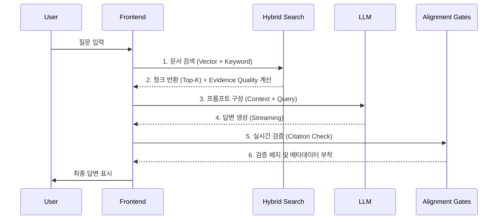

# RAG Pipeline Deep Dive & P1 Features

본 문서는 PRISM Writer의 핵심 엔진인 **RAG (Retrieval-Augmented Generation) 파이프라인**의 상세 작동 원리와 **RAG Alignment P1** 업데이트로 추가된 품질/안전장치 로직을 심층적으로 다룹니다.

---

## 🔁 1. RAG 파이프라인 흐름 (Overview)

전체 파이프라인은 크게 **Ingestion (수집)**, **Retrieval (검색)**, **Generation (생성)**, **Alignment (검증)** 단계로 나뉩니다.

---

## 📥 2. Ingestion (데이터 수집 및 임베딩)

사용자가 업로드한 문서는 다음과 같은 과정을 거쳐 검색 가능한 형태로 저장됩니다.

1.  **Parsing**: PDF/TXT 파일을 텍스트로 변환
2.  **Chunking**: Recursive Character splitter 사용 (Chunk Size: 1000, Overlap: 200)
3.  **Embedding**: `text-embedding-3-small` (1536차원) 사용하여 벡터화
4.  **Storage**: `rag_chunks` 테이블에 `content`(텍스트)와 `embedding`(벡터) 저장

---

## 🔍 3. Retrieval (하이브리드 검색)

단순 벡터 검색의 한계를 보완하기 위해 **Hybrid Search**와 **RRF**를 사용합니다.

### 3-1. 검색 전략

- **Vector Search**: 의미적 유사성(Semantic Similarity) 검색. (`pgvector` 코사인 유사도)
- **Keyword Search**: 정확한 단어 매칭. (PostgreSQL `tsvector`)

### 3-2. RRF (Reciprocal Rank Fusion)

두 검색 결과를 순위 기반으로 병합합니다.
$$ Score = \frac{1}{k + rank} $$

- 이를 통해 키워드 매칭이 강력한 문서와 의미적으로 유사한 문서를 균형있게 추출합니다.

### 3-3. Evidence Quality (P1-C)

검색된 청크의 품질을 실시간으로 계산하여 `Low/Medium/High` 등급을 매깁니다.

- **Vector Score**: 0.78 이상(High), 0.72 이상(Medium)
- **Recency**: 1년 이내 문서에 가산점 부여 (P1 신규 로직)

---

## 🛡️ 4. Alignment & Safety (P1 Features)

RAG의 고질적인 문제인 환각(Hallucination)을 억제하고 답변의 신뢰도를 높이기 위한 장치들입니다.

### 4-1. Citation Gate (P1-A)

AI가 생성한 답변의 인용구가 실제 청크에 존재하는지 검증합니다.

- **작동 원리**: 답변 내 인용문과 소스 청크 간의 유사도(Jaccard + Substring) 비교
- **임계값**: 유사도 0.6 이상이어야 Valid 판정
- **결과**: `verified: true/false` 메타데이터를 메시지에 저장하고 UI에 배지 표시

### 4-2. Patch Staging (P1-B)

에디터 모드에서 AI의 수정 제안을 한 번에 적용하지 않고, 유형별로 분류하여 사용자가 선택하게 합니다.

- **분류 기준**:
  - `CORE`: 사실 관계, 숫자 등 핵심 정보 수정
  - `EXPRESSION`: 문체, 톤앤매너 수정
  - `DETAIL`: 맞춤법, 띄어쓰기 등
- **Gate Logic**: 각 패치의 변경 폭과 위험도를 분석하여 위의 카테고리로 자동 분류 (`patchGates.ts`)

### 4-3. Criteria Pack (P1-D)

사용자가 정의한 '글쓰기 규칙'을 RAG 파이프라인에 주입합니다.

- **저장소**: `criteria_pack` 테이블
- **활용**: 시스템 프롬프트에 "사용자 규칙: ~하지 말 것" 형태로 동적 주입되어 AI의 행동 제어

---

## 💾 5. 데이터베이스 스키마 (주요 테이블)

### `rag_documents`

- 업로드된 원본 문서 메타데이터 (제목, 업로드 일시 등)

### `rag_chunks`

- 실제 검색 대상 데이터
- `embedding`: vector(1536)
- `chunk_type`: text | image | table (멀티모달 대비)

### `criteria_pack`

- 사용자 정의 검증 규칙 저장소
- `criteria_definition`: JSONB 형태로 규칙/예시 저장
