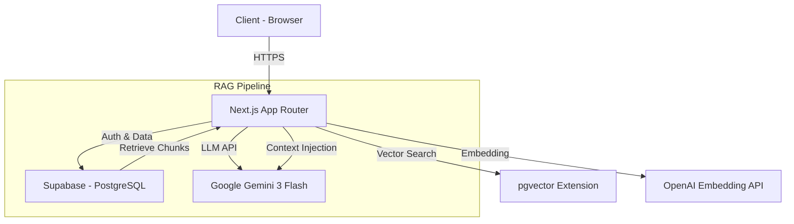

# PRISM Writer Technical Reference (v2.1)

> **최종 업데이트**: 2026-01-01

본 문서는 PRISM Writer의 시스템 아키텍처, 기술 스택, 프로젝트 구조 및 배포 워크플로우를 기술한 개발자 문서입니다.

---

## 1. 시스템 아키텍처

PRISM Writer는 **Next.js 14 App Router** 기반의 풀스택 웹 애플리케이션으로, **Supabase**를 BaaS로 활용합니다.

### High-Level Overview



### Core Components

| 레이어 | 기술 | 역할 |
|:-------|:-----|:-----|
| **Frontend** | Next.js 14, React, TailwindCSS | UI 렌더링, 라우팅 |
| **API** | Next.js API Routes | 서버 로직, LLM 호출 |
| **Database** | Supabase (PostgreSQL + pgvector) | 데이터 저장, 벡터 검색 |
| **Auth** | Supabase Auth | 인증 (Email, Google OAuth) |
| **AI Engine** | Google Gemini 3 Flash | 답변 생성, 평가 |
| **Embedding** | OpenAI text-embedding-3-small | 문서 벡터화 |

---

## 2. 기술 스택

### Frontend

| 항목 | 기술 | 버전 |
|:-----|:-----|:-----|
| Framework | Next.js (App Router) | 14.x |
| Language | TypeScript | 5.x |
| Styling | TailwindCSS | 3.3 |
| State | Zustand (전역), React Context (로컬) | 4.x |
| Editor | @uiw/react-md-editor | - |

### Backend (Supabase)

| 항목 | 기술 | 비고 |
|:-----|:-----|:-----|
| Database | PostgreSQL | 15+ |
| Vector DB | pgvector | 1536차원 |
| Auth | Supabase Auth | RLS 연동 |
| Storage | Supabase Storage | PDF 파일 저장 |

### AI & RAG

| 항목 | 기술 | 용도 |
|:-----|:-----|:-----|
| LLM | `gemini-3-flash-preview` | 답변 생성, 평가 |
| Embedding | `text-embedding-3-small` | 문서 벡터화 |
| Search | Hybrid (Vector + Keyword) | RRF 기반 검색 |

---

## 3. 디렉토리 구조

```
prismLM/
├── frontend/                    # Next.js 애플리케이션
│   ├── src/
│   │   ├── app/                 # App Router
│   │   │   ├── api/             # API Routes
│   │   │   │   ├── chat/        # AI 채팅
│   │   │   │   ├── projects/    # 프로젝트 CRUD
│   │   │   │   ├── documents/   # 문서 업로드
│   │   │   │   └── rag/         # RAG 검색/평가
│   │   │   ├── dashboard/       # 대시보드
│   │   │   ├── editor/          # 에디터
│   │   │   ├── documents/       # 문서 관리
│   │   │   └── trash/           # 휴지통
│   │   ├── components/          # React 컴포넌트
│   │   ├── lib/                 # 핵심 로직
│   │   │   ├── rag/             # RAG 파이프라인
│   │   │   ├── llm/             # LLM Gateway
│   │   │   └── supabase/        # DB 클라이언트
│   │   ├── config/              # 설정 파일
│   │   │   ├── models.ts        # LLM 모델 레지스트리
│   │   │   ├── llm-usage-map.ts # 서비스별 모델 매핑
│   │   │   └── featureFlags.ts  # Feature Flags
│   │   ├── contexts/            # React Context
│   │   ├── hooks/               # Custom Hooks
│   │   └── types/               # TypeScript 타입
│   └── public/                  # 정적 파일
├── supabase/
│   └── migrations/              # SQL 마이그레이션
├── docs/                        # 기술 문서
└── plan_report/                 # 기획 문서 (수정 금지)
```

---

## 4. 배포 워크플로우

### CI/CD Pipeline (Vercel)

1. **Push to `main`**: GitHub 메인 브랜치에 푸시 시 Vercel 배포 트리거
2. **Build**: `npm run build` 실행 (타입 체크 + 빌드)
3. **Deploy**: 빌드 성공 시 Production 배포

### 환경 변수 관리

| 환경 | 설정 위치 |
|:-----|:----------|
| 로컬 개발 | `frontend/.env.local` |
| Preview | Vercel Dashboard > Environment Variables |
| Production | Vercel Dashboard > Environment Variables |

### Database Migration

```bash
# Supabase CLI 사용
supabase db push

# 또는 SQL Editor에서 직접 실행
# supabase/migrations/ 폴더의 SQL 파일 순서대로 실행
```

---

## 5. 보안

### RLS (Row Level Security)

모든 테이블에 RLS 정책 적용:

```sql
-- 예: projects 테이블
CREATE POLICY "projects_owner_full_access" ON public.projects
  FOR ALL USING (auth.uid() = user_id)
  WITH CHECK (auth.uid() = user_id);
```

### API 키 관리

| 키 | 용도 | 노출 가능 |
|:---|:-----|:----------|
| `NEXT_PUBLIC_SUPABASE_URL` | Supabase URL | O (Public) |
| `NEXT_PUBLIC_SUPABASE_ANON_KEY` | 클라이언트 인증 | O (RLS로 보호) |
| `GOOGLE_API_KEY` | Gemini API | X (서버 전용) |
| `OPENAI_API_KEY` | Embedding API | X (서버 전용) |

### View 생성 규칙

```sql
-- 항상 security_invoker = true 사용 (RLS 적용)
CREATE VIEW my_view WITH (security_invoker = true) AS
SELECT * FROM sensitive_table;
```

---

## 6. 주요 API 엔드포인트

### 프로젝트 관리

| Method | Endpoint | 설명 |
|:-------|:---------|:-----|
| `GET` | `/api/projects` | 목록 조회 (deleted_at IS NULL) |
| `POST` | `/api/projects` | 생성 |
| `DELETE` | `/api/projects/:id` | 소프트 삭제 |
| `GET` | `/api/projects/trash` | 휴지통 목록 |
| `PATCH` | `/api/projects/:id/restore` | 복구 |
| `DELETE` | `/api/projects/:id/permanent` | 영구 삭제 |

### RAG & AI

| Method | Endpoint | 설명 |
|:-------|:---------|:-----|
| `POST` | `/api/chat` | AI 채팅 (스트리밍) |
| `POST` | `/api/rag/search` | 벡터 검색 |
| `POST` | `/api/rag/evaluate` | 글 평가 |

### 문서

| Method | Endpoint | 설명 |
|:-------|:---------|:-----|
| `POST` | `/api/documents/upload` | 파일 업로드 + 벡터화 |
| `GET` | `/api/documents` | 문서 목록 |
| `DELETE` | `/api/documents/:id` | 문서 삭제 |

---

## 7. 데이터베이스 스키마

### 주요 테이블

| 테이블 | 용도 |
|:-------|:-----|
| `projects` | 프로젝트 메타데이터, 소프트 삭제 지원 |
| `rag_documents` | 업로드된 문서 메타데이터 |
| `rag_chunks` | 문서 청크 + 임베딩 벡터 |
| `chat_sessions` | 채팅 세션 |
| `chat_messages` | 채팅 메시지 |
| `rag_templates` | 평가 템플릿 |

### 소프트 삭제 구현

```sql
-- projects 테이블
deleted_at TIMESTAMPTZ DEFAULT NULL  -- NULL=활성, 값=휴지통

-- 30일 후 자동 삭제 함수
CREATE FUNCTION cleanup_deleted_projects() RETURNS void AS $$
BEGIN
  DELETE FROM public.projects
  WHERE deleted_at IS NOT NULL
  AND deleted_at < now() - INTERVAL '30 days';
END;
$$ LANGUAGE plpgsql;
```

---

_이 문서는 PRISM Writer 개발팀의 기술 레퍼런스입니다._
