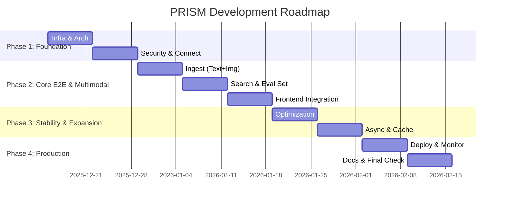

# 💎 PRISM 웹서비스 개발 로드맵 (Revised Final)

**문서 버전:** 1.1 (수정 제안 반영본)  
**날짜:** 2025-12-14  
**작성자:** Senior Developer (Antigravity)

---

## 1. 수정 제안 요약 (Review & Refinement)

기존 회의록의 **"Hybrid Approach (Vertical Slice + Foundation First + Security by Design)"** 를 지지하며, 다음 **3가지 핵심 사항**을 보완하여 로드맵을 확정합니다.

### 1.1 🖼️ Multimodal Scope 재정의 (MVP 필수 포함)

- **문제:** "Multimodal RAG"를 표방하면서 멀티모달 고도화를 Phase 5로 미루는 것은 프로젝트 정체성을 약화시킴.
- **수정:** **Phase 2**에 **"Basic Multimodal (Image to Caption)"** 기능을 필수 포함.
  - 복잡한 레이아웃 분석은 나중으로 미루더라도, 이미지를 업로드하면 캡션을 생성해 검색되게 하는 것은 MVP에 포함되어야 함.

### 1.2 💸 Zero Cost 전략의 현실화 (Redis/Celery 대안)

- **문제:** Phase 3의 Redis, Celery는 별도 인스턴스가 필요하여 "Zero Cost" 원칙 위배 가능성 높음 (Render Redis 유료, Celery 워커 컨테이너 필요).
- **수정:**
  - **Queue:** `Celery` 대신 **Postgres-based Queue** (Supabase 활용) 또는 Python `asyncio.Queue` (단일 인스턴스 내) 사용.
  - **Cache:** `Redis` 대신 **In-memory Cache** (LRU) 또는 **Upstash Redis** (Free Tier) 명시.

### 1.3 📉 Evaluation First (평가 주도 개발)

- **문제:** 평가셋 구축이 Phase 3에 위치함. 검색 품질을 측정할 기준 없이 Phase 2를 개발하는 것은 위험.
- **수정:** **Phase 2** 시작 시점에 **"Golden Set (20 Q/A)"** 구축을 먼저 진행하여 개발 방향성 가이드.

---

## 2. 최종 확정 로드맵 (9 Weeks)

### 📅 전체 일정 요약

---

### 🚀 Phase 1: 기반 구축 (Week 1-2)

> **목표:** 흔들리지 않는 아키텍처와 보안/인프라 기반 마련

#### Week 1: 인프라 및 아키텍처

- **[Infra]** Docker 개발환경 (`docker-compose.dev.yml`) 및 GitHub Actions 기초.
- **[DB]** Supabase 프로젝트 생성, `pgvector` 활성화, 기본 테이블(`documents`, `chunks`) 생성.
- **[Arch]** Hexagonal Architecture 폴더 구조 및 Domain Entity(`Document`, `Chunk`) 정의.

#### Week 2: 보안 기반 및 연결 테스트

- **[Security]** Supabase Auth + **RLS(Row Level Security)** 정책 적용 (필수).
- **[Backend]** Supabase 연결 테스트 및 Health Check API 구현.
- **[Frontend]** Next.js 프로젝트 초기화 (Tailwind CSS).

---

### 💎 Phase 2: 핵심 E2E & Basic Multimodal (Week 3-5)

> **목표:** 텍스트와 이미지를 업로드하고, 질문하면 근거를 찾아 답변하는 "동작하는 MVP" 완성

#### Week 3: 인제스트 파이프라인 (Text + Image)

- **[AI/ML]** **Basic Multimodal:** 이미지 업로드 시 VLM(GPT-4o-mini 등)으로 Caption 생성 → 텍스트와 동일하게 임베딩.
- **[Backend]** 파일 업로드 API 및 파싱/청킹/임베딩 파이프라인 구현.
- **[Security]** 파일 업로드 검증 (MIME Type, Magic Number).

#### Week 4: 검색, 답변 및 평가셋

- **[AI/ML]** **Evaluation First:** 평가용 Golden Set (질문-답변-근거 쌍 20개) 구축.
- **[AI/ML]** Vector Search + Hybrid Search (Simple) 구현.
- **[Backend]** 검색 및 채팅 API 구현.

#### Week 5: 프론트엔드 연동

- **[Frontend]** Drag & Drop 업로드 UI, 채팅창, **근거 카드(Source Card)** UI.
- **[All]** **E2E 마일스톤:** 파일 업로드 → 캡션 생성/파싱 → 검색 → 답변 성공.

---

### ⚖️ Phase 3: 기능 확장 및 안정화 (Week 6-7)

> **목표:** 성능을 최적화하고 운영 비용을 제어하며 사용자 경험 향상

#### Week 6: 성능 최적화

- **[DB]** HNSW 인덱스 튜닝 및 Hybrid Search 고도화.
- **[AI/ML]** Reranking 도입 (Cross-Encoder 또는 Cohere Free Tier).
- **[Backend]** **Rate Limiting** (slowapi) 적용으로 API 비용 폭주 방지.

#### Week 7: 안정화 (Zero Cost Strategy)

- **[Backend]** **Lightweight Async Queue:** Postgres(Supabase) 기반 작업 큐 구현 (별도 Celery 워커 없이).
- **[Backend]** **In-memory Caching:** 자주 묻는 질문/임베딩에 대한 로컬 캐싱 (LRU).
- **[Frontend]** Streaming 응답 처리 및 업로드 진행률 표시.

---

### 📦 Phase 4: 프로덕션 준비 (Week 8-9)

> **목표:** 실제 사용자가 쓸 수 있는 배포 환경과 운영 체계 구축

#### Week 8: 배포 및 모니터링

- **[DevOps]** Render(Backend) + Vercel(Frontend) 배포 파이프라인.
- **[DevOps]** **Blue-Green Deployment** (수동 또는 스크립트 기반).
- **[Monitor]** Sentry(에러), UptimeRobot(가동시간), **비용 모니터링 대시보드**.

#### Week 9: 문서화 및 최종 점검

- **[Security]** Audit Log 활성화 및 취약점 스캔.
- **[Docs]** API 문서, 사용자 가이드 작성.
- **[Final]** 최종 E2E 테스트 및 백업/복구 리허설.

---

## 3. 역할별 핵심 변경 사항 (RACI Update)

| 역할         | 변경/강조 사항                                                                  |
| :----------- | :------------------------------------------------------------------------------ |
| **AI/ML**    | Phase 2에 **Basic Multimodal(Captioning)** 구현 포함, **평가셋 선행 구축**.     |
| **Backend**  | Celery/Redis 대신 **Postgres Queue / In-memory Cache**로 Zero Cost 구조 최적화. |
| **Database** | HNSW 인덱스 및 RLS 정책의 초기 안정성 확보 집중.                                |
| **Frontend** | 근거 카드 UI에서 **이미지 썸네일/캡션** 노출 지원 필요.                         |

---

## 4. 결론

이 수정된 로드맵은 기존의 합의된 **Hybrid Approach**를 유지하면서, **"Multimodal RAG"**라는 제품의 핵심 가치를 MVP 단계에서부터 확실히 하고, **"Zero Cost"**라는 제약 조건을 기술적으로 더 정교하게 풀어냈습니다.

**승인 요청:** 위 수정 사항을 반영하여 Phase 1 개발을 즉시 착수하고자 합니다.
