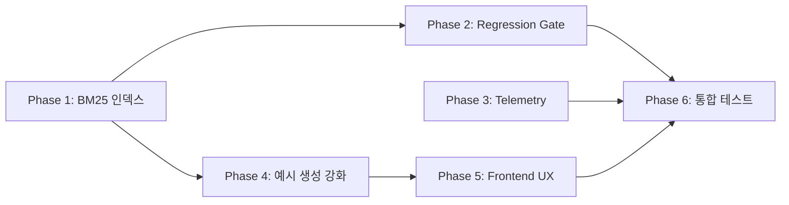

# Pipeline v4 업그레이드 체크리스트

> **문서 버전**: v1.0  
> **생성일**: 2025-12-25  
> **기반 문서**: `2512251330_파이프라인 재정의_v2.md`  
> **목적**: 기존 RAG 시스템을 "Example Mining/Generation → Template Induction → Alignment Judge" 파이프라인으로 업그레이드

---

## 📋 체크리스트 파일 구성 결정 및 근거

### 선택: **단일 파일 구성**

**근거**:

1. **업그레이드 항목들 간의 높은 연결성**: Phase A(Template Builder)의 출력이 Phase B(Judge)의 입력이 되므로 분리 시 추적이 어려움
2. **협업 효율성**: 시니어/주니어/UX 담당자가 동일 문서에서 전체 맥락을 파악 가능
3. **검증 통합**: Phase 간 통합 테스트가 필수이므로 단일 문서 내 교차 참조가 용이
4. **기존 구현 존재**: Pipeline v3가 이미 상당 부분 구현되어 있어, 증분 업그레이드가 주요 작업

---

## 🎯 업그레이드 핵심 목표 (파이프라인 재정의 v2 기반)

| 구분              | 기존 (v3)                                  | 업그레이드 (v4)                                                                     |
| ----------------- | ------------------------------------------ | ----------------------------------------------------------------------------------- |
| **파이프라인**    | 지식베이스 → 근거 검색 → Judge             | 지식베이스 → **(예시 채굴/생성 강화)** → **템플릿 자동 구성 + 검증 게이트** → Judge |
| **BM25 인덱스**   | 단일 인덱스                                | **Rule Index + Example Index 분리**                                                 |
| **예시 처리**     | Mining 또는 Generation                     | Mining 우선 → **근거 기반 Generation**                                              |
| **게이트 시스템** | 3종 (Citation, Consistency, Hallucination) | **추가: Regression Gate**                                                           |
| **Telemetry**     | 단일 run_id                                | **build_run_id + judge_run_id 분리**                                                |

---

## 🔍 현재 코드베이스 분석 요약

### 기존 구현 파일 (Pipeline v3)

| 파일                                            | 역할                   | 상태            |
| ----------------------------------------------- | ---------------------- | --------------- |
| `frontend/src/lib/rag/templateBuilder.ts`       | 템플릿 빌드 파이프라인 | ✅ 구현됨       |
| `frontend/src/lib/rag/exampleMiner.ts`          | 예시 채굴/생성         | ✅ 구현됨       |
| `frontend/src/lib/rag/ruleMiner.ts`             | 규칙 추출              | ✅ 구현됨       |
| `frontend/src/lib/rag/templateGates.ts`         | 템플릿 검증 게이트     | ✅ 구현됨 (3종) |
| `frontend/src/lib/rag/reranker.ts`              | 리랭킹 + 예시 부스트   | ✅ 구현됨       |
| `frontend/src/lib/rag/search.ts`                | 하이브리드 검색        | ✅ 구현됨       |
| `backend/migrations/021_pipeline_v3_schema.sql` | DB 스키마              | ✅ 적용됨       |

### 업그레이드가 필요한 영역

1. **BM25 2종 인덱스 분리** (Rule Index + Example Index)
2. **Template Regression Gate 추가**
3. **Template Validation Set 관리**
4. **Telemetry 분리 (build_run_id / judge_run_id)**
5. **UI: 예시 기반 3단 결과 화면**

---

## 📦 Phase 1: BM25 인덱스 분리 (Rule/Example)

### 영향받을 수 있는 기존 기능

- `hybridSearch()` 함수의 검색 결과
- `fullTextSearch()` 함수의 키워드 매칭
- `mineRulesByCategory()` 의 규칙 검색
- `mineExamplesForRule()` 의 예시 검색

### 1.1 Backend: 인덱스 스키마 추가

- [ ] **파일**: `backend/migrations/030_bm25_dual_index.sql` [NEW]
- [ ] **작업 내용**:
  - `rag_chunks` 테이블에 `chunk_type` ENUM 컬럼 추가 (`rule`, `example`, `general`)
  - Rule 전용 GIN 인덱스 생성: `idx_chunks_rule_keywords`
  - Example 전용 GIN 인덱스 생성: `idx_chunks_example_keywords`
  - 예시 신호 감지 함수 생성 (따옴표, "예를 들어", before/after 패턴)

**품질 기준**:

- [ ] 코딩 스타일: SQL 파일 네이밍 규칙 (`NNN_description.sql`)
- [ ] 명확한 인덱스명: 용도를 명확히 설명
- [ ] 에러 처리: `IF NOT EXISTS` 사용
- [ ] 성능: 인덱스 생성 시 CONCURRENTLY 옵션 고려

### 1.2 Frontend: chunking.ts 청크 유형 분류 기능 추가

- [ ] **파일**: `frontend/src/lib/rag/chunking.ts` (약 100번대 라인)
- [ ] **작업 내용**:
  - `classifyChunkType(content: string): ChunkType` 함수 추가
  - 분류 로직:
    - 따옴표 포함 + 구체적 표현 → `example`
    - "~해야 한다", "~하지 마라" 패턴 → `rule`
    - 그 외 → `general`
- [ ] **연결**: `processDocument()` 함수에서 청킹 후 분류 호출

**품질 기준**:

- [ ] 함수명: `classifyChunkType` - 명확함
- [ ] 에러 처리: 분류 실패 시 `general` 반환
- [ ] 성능: 정규식 사전 컴파일, 불필요한 반복 제거

### 1.3 Frontend: search.ts 청크 유형 필터 추가

- [ ] **파일**: `frontend/src/lib/rag/search.ts` (`SearchOptions` 인터페이스, 약 34번 라인)
- [ ] **작업 내용**:
  - `SearchOptions`에 `chunkType?: ChunkType` 옵션 이미 존재 ✅ 확인
  - `fullTextSearch()` 함수에 `chunkType` 필터 쿼리 조건 추가 (약 200번 라인)
  - `vectorSearch()` 함수에 `chunkType` 필터 쿼리 조건 추가 (약 120번 라인)

**품질 기준**:

- [ ] 기존 API 호환성 유지 (옵션 미지정 시 전체 검색)
- [ ] 명확한 쿼리 빌더 패턴
- [ ] 에러 처리: 잘못된 chunkType 값 검증

---

### Phase 1 검증 체크리스트

```
□ Syntax 오류 확인
  - 명령어: cd frontend && npx tsc --noEmit

□ 브라우저 테스트 항목
  - 기존 문서 업로드 및 처리 정상 동작
  - 검색 결과에 청크 유형 표시 확인 (개발자 도구 콘솔)

□ 기존 기능 정상 동작 확인
  - hybridSearch() 호출 시 기존 결과와 동일
  - chunkType 필터 테스트: rule만 검색, example만 검색
```

---

## 📦 Phase 2: Template Regression Gate 추가

### 영향받을 수 있는 기존 기능

- `validateAllGates()` 함수 (templateGates.ts)
- `TemplateBuilder.build()` 메서드
- 기존 템플릿 검증 통과/실패 로직

### 2.1 Backend: Template Validation Set 테이블 생성

- [ ] **파일**: `backend/migrations/031_template_validation_set.sql` [NEW]
- [ ] **작업 내용**:
  - `template_validation_samples` 테이블 생성
    - `id`, `template_id`, `sample_text`, `expected_verdict` (pass/partial/fail), `created_at`
  - RLS 정책 설정 (tenant 기반)

**품질 기준**:

- [ ] 테이블명/컬럼명 명확
- [ ] FK 관계 정확히 설정
- [ ] 인덱스: `template_id`에 인덱스 필수

### 2.2 Frontend: templateGates.ts에 Regression Gate 추가

- [ ] **파일**: `frontend/src/lib/rag/templateGates.ts` (약 166번 라인 이후)
- [ ] **작업 내용**:
  - `validateRegressionGate(template, previousVersion)` 함수 추가
  - 로직:
    1. validation_samples에서 이전 버전 테스트 케이스 조회
    2. 새 템플릿으로 동일 샘플 평가
    3. 결과 비교: 허용 범위(±10%) 이탈 시 실패
  - `AllGatesResult` 인터페이스에 `regressionResult` 추가
  - `validateAllGates()` 함수에 regression gate 통합
- [ ] **연결**: `22번 라인 AllGatesResult` 인터페이스 수정
- [ ] **연결**: `166번 라인 validateAllGates` 함수 수정

**품질 기준**:

- [ ] 함수명: `validateRegressionGate` - 명확함
- [ ] 에러 처리: 이전 버전/샘플이 없으면 통과 처리 (신규 템플릿 케이스)
- [ ] 성능: 샘플 수 제한 (최대 10개)
- [ ] 접근성: N/A (백엔드 로직)

### 2.3 Frontend: templateTypes.ts에 ValidationSample 타입 추가

- [ ] **파일**: `frontend/src/lib/rag/templateTypes.ts`
- [ ] **작업 내용**:
  - `ValidationSample` 인터페이스 추가
  - `TemplateVersion` 인터페이스 추가 (버전 추적용)

**품질 기준**:

- [ ] 타입명 명확
- [ ] JSDoc 주석 추가

---

### Phase 2 검증 체크리스트

```
□ Syntax 오류 확인
  - 명령어: cd frontend && npx tsc --noEmit

□ 단위 테스트
  - validateRegressionGate() 테스트 케이스 작성
  - 이전 버전 없을 때 통과 확인
  - 결과 변동 허용 범위 내 통과 확인
  - 결과 변동 허용 범위 초과 시 실패 확인

□ 기존 기능 정상 동작 확인
  - validateAllGates() 호출 시 기존 3종 게이트 정상 동작
  - 새 템플릿 생성 시 정상 통과
```

---

## 📦 Phase 3: Telemetry 분리 (build_run_id / judge_run_id)

### 영향받을 수 있는 기존 기능

- 기존 telemetry 테이블 (`019_telemetry_schema.sql`)
- `telemetry.ts` 파일의 로깅 함수들
- 모니터링 대시보드 (있을 경우)

### 3.1 Backend: Telemetry 테이블 확장

- [ ] **파일**: `backend/migrations/032_telemetry_run_type.sql` [NEW]
- [ ] **작업 내용**:
  - `telemetry_runs` 테이블에 `run_type` ENUM 추가 (`build`, `judge`)
  - 기존 데이터 마이그레이션: 모두 `judge`로 설정
  - 인덱스 추가: `(run_type, created_at)`

**품질 기준**:

- [ ] 하위 호환성 유지 (기존 데이터 보존)
- [ ] 마이그레이션 롤백 스크립트 포함

### 3.2 Frontend: telemetry.ts 분리 로깅 함수 추가

- [ ] **파일**: `frontend/src/lib/telemetry.ts`
- [ ] **작업 내용**:
  - `logBuildRun(documentId, metrics)` 함수 추가
    - `run_type: 'build'`
    - 측정 항목: 템플릿 채택률, 예시 재사용률, 생성 예시 비율
  - `logJudgeRun(templateId, userTextId, metrics)` 함수 추가
    - `run_type: 'judge'`
    - 기존 평가 로깅과 동일
- [ ] **연결**: `TemplateBuilder.build()` 메서드에서 `logBuildRun()` 호출
- [ ] **연결**: Judge 평가 API에서 `logJudgeRun()` 호출

**품질 기준**:

- [ ] 함수명 명확: `logBuildRun`, `logJudgeRun`
- [ ] 에러 처리: 로깅 실패 시 main flow 블록하지 않음 (try-catch)
- [ ] 성능: 비동기 처리, 배치 가능

### 3.3 Frontend: templateBuilder.ts에 Telemetry 통합

- [ ] **파일**: `frontend/src/lib/rag/templateBuilder.ts` (약 115번 라인, build 완료 후)
- [ ] **작업 내용**:
  - `build()` 메서드 완료 시점에 `logBuildRun()` 호출
  - 측정 지표:
    - `template_adoption_rate`: 생성→검증통과 비율
    - `example_reuse_rate`: 찾은 예시 vs 생성 예시 비율
    - `processing_time_ms`: 빌드 소요 시간

**품질 기준**:

- [ ] 비즈니스 로직과 telemetry 로직 분리
- [ ] 성능: 메트릭 계산은 O(1) 또는 O(n)

---

### Phase 3 검증 체크리스트

```
□ Syntax 오류 확인
  - 명령어: cd frontend && npx tsc --noEmit

□ 브라우저 테스트 항목
  - 템플릿 빌드 후 Supabase에서 telemetry_runs 확인
  - run_type = 'build' 레코드 생성 확인

□ 기존 기능 정상 동작 확인
  - 기존 judge 평가 시 run_type = 'judge' 로깅 정상
```

---

## 📦 Phase 4: 예시 생성 근거 강화

### 영향받을 수 있는 기존 기능

- `generateExamplesForRule()` 함수 (exampleMiner.ts)
- 생성된 예시의 source_citations 필드

### 4.1 Frontend: exampleMiner.ts 근거 인용 강제

- [ ] **파일**: `frontend/src/lib/rag/exampleMiner.ts` (약 108번 라인, `generateExamplesForRule`)
- [ ] **작업 내용**:
  - 프롬프트 수정: 예시 생성 시 반드시 `source_rule_quotes` 포함하도록 지시
  - 출력 JSON 형식에 `source_rule_quotes: string[]` 필드 추가
  - 생성 후 검증: `source_rule_quotes`가 비어있으면 재시도 또는 실패 처리
- [ ] **연결**: `ExampleSet` 인터페이스에 `source_rule_quotes` 필드 추가 (약 25번 라인)

**품질 기준**:

- [ ] 프롬프트 명확성: 인용 형식 예시 제공
- [ ] 에러 처리: 인용 없을 시 fallback 로직
- [ ] 성능: 재시도 횟수 제한 (최대 2회)

### 4.2 Frontend: prompts/exampleGeneration.ts 프롬프트 강화

- [ ] **파일**: `frontend/src/lib/rag/prompts/exampleGeneration.ts`
- [ ] **작업 내용**:
  - `EXAMPLE_GENERATION_SYSTEM_PROMPT` 수정
  - "반드시 원문에서 인용할 수 있는 근거 문장을 포함하세요" 지시 추가
  - 출력 형식에 `source_rule_quotes` 필드 명시

**품질 기준**:

- [ ] 프롬프트 문법 정확
- [ ] 한글/영어 혼용 최소화

---

### Phase 4 검증 체크리스트

```
□ Syntax 오류 확인
  - 명령어: cd frontend && npx tsc --noEmit

□ 단위 테스트
  - generateExamplesForRule() 호출 시 source_rule_quotes 반환 확인

□ 브라우저 테스트 항목
  - 새 문서 업로드 → 템플릿 빌드 → 생성된 예시에 source_rule_quotes 존재 확인
```

---

## 📦 Phase 5: Frontend UX - 예시 기반 3단 결과 화면

### 영향받을 수 있는 기존 기능

- 평가 결과 표시 UI 컴포넌트
- 기존 피드백 레이아웃

### 5.1 Frontend: 평가 결과 UI 컴포넌트 수정

- [ ] **파일**: `frontend/src/components/` (관련 컴포넌트 탐색 필요)
- [ ] **작업 내용**:
  - 3단 레이아웃 컴포넌트 생성/수정:
    1. **규칙 패널**: 적용된 규칙 표시
    2. **예시 패널**: 좋은 예/나쁜 예 대비 표시
    3. **내 글 패널**: 사용자 글의 해당 문장 하이라이트
  - 업그레이드 플랜 표시: "이렇게 바꾸세요" 형식

**품질 기준**:

- [ ] 접근성: `aria-label` 추가 (규칙 패널, 예시 패널, 내 글 패널)
- [ ] 반응형 레이아웃 (모바일 고려)
- [ ] 색상 대비: WCAG AA 기준 충족

### 5.2 Frontend: 업그레이드 플랜 카드 컴포넌트

- [ ] **파일**: `frontend/src/components/UpgradePlanCard.tsx` [NEW]
- [ ] **작업 내용**:
  - Props: `currentText`, `suggestedText`, `diffHints`
  - Before/After 시각적 대비 표시
  - 복사 버튼 추가

**품질 기준**:

- [ ] 접근성: 복사 버튼에 `aria-label="제안된 텍스트 복사"`
- [ ] 키보드 네비게이션 지원

---

### Phase 5 검증 체크리스트

```
□ Syntax 오류 확인
  - 명령어: cd frontend && npm run build

□ 브라우저 테스트 항목
  - 평가 결과 화면에서 3단 레이아웃 표시 확인
  - 각 패널 내용 정상 렌더링 확인
  - 모바일 뷰포트에서 레이아웃 붕괴 없음
  - 복사 버튼 동작 확인

□ 접근성 테스트
  - 스크린리더로 각 패널 탐색 가능
  - 키보드로 모든 인터랙션 가능
```

---

## 📦 Phase 6: 통합 테스트 및 배포 준비

### 영향받을 수 있는 기존 기능

- 전체 RAG 파이프라인
- 프로덕션 환경 안정성

### 6.1 통합 테스트 시나리오

- [ ] **End-to-End 테스트**:
  - 새 문서 업로드 → 청크 분류 확인 → 규칙 추출 → 예시 채굴/생성 → 템플릿 빌드 → 게이트 통과 → 평가 실행 → 결과 UI 표시
- [ ] **Regression 테스트**:
  - 기존 문서 재처리 시 결과 일관성 확인
  - 기존 템플릿으로 평가 시 기존 결과와 비교

### 6.2 배포 체크리스트

- [ ] 모든 SQL 마이그레이션 Supabase에 적용
- [ ] 환경 변수 확인 (OPENAI_API_KEY 등)
- [ ] Vercel 배포 후 기능 검증
- [ ] 롤백 계획 수립

---

### Phase 6 검증 체크리스트

```
□ 통합 테스트
  - E2E 시나리오 전체 통과
  - 기존 기능 regression 없음

□ 성능 테스트
  - 템플릿 빌드 소요 시간 < 30초
  - 평가 응답 시간 < 5초

□ 배포 검증
  - Vercel 배포 성공
  - 프로덕션 환경 기능 정상
```

---

## 📝 추가 참고 사항

### 담당자 역할 분담 (권장)

| 역할              | 담당 Phase                                         |
| ----------------- | -------------------------------------------------- |
| **시니어 개발자** | Phase 1 (인덱스), Phase 2 (게이트), Phase 6 (통합) |
| **주니어 개발자** | Phase 3 (Telemetry), Phase 4 (예시 생성)           |
| **UX/UI 개발자**  | Phase 5 (Frontend UI)                              |

### 작업 순서 의존성



---

## ✅ 최종 완료 기준

- [ ] 모든 Phase 검증 체크리스트 통과
- [ ] Supabase 마이그레이션 완료
- [ ] Vercel 프로덕션 배포 완료
- [ ] 사용자 테스트 피드백 수집 (선택)
