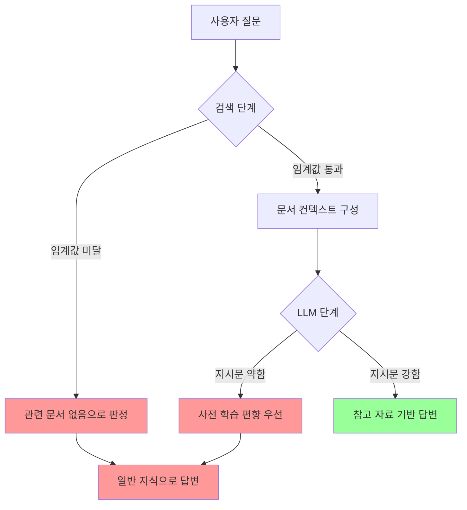

# RAG 환각 답변 개선 회의록

> **작성일**: 2025-12-27
> **작성자**: 시니어 개발자 (RAG 시스템 아키텍트)
> **회의 주제**: PRISM Writer RAG 시스템 환각 답변 문제 해결
> **문서 상태**: 초안 (디렉터님 검토 필요)

---

## 📋 목차

1. [회의 개요](#1-회의-개요)
2. [참여 전문가 소개](#2-참여-전문가-소개)
3. [문제 정의](#3-문제-정의)
4. [원인 분석](#4-원인-분석)
5. [현재 시스템 코드 분석](#5-현재-시스템-코드-분석)
6. [해결 전략 제안](#6-해결-전략-제안)
7. [구현 우선순위](#7-구현-우선순위)
8. [액션 아이템](#8-액션-아이템)
9. [예상 효과](#9-예상-효과)

---

## 1. 회의 개요

### 배경

PRISM Writer의 RAG 기반 AI 채팅 시스템에서 **'환각 답변'** 문제가 발생하고 있습니다. 사용자가 "글을 쓸 때 어떻게 써야 하나요?"라는 질문을 했을 때, 시스템에 관련 참고 자료가 있음에도 불구하고 모델이 "참고 자료에 내용이 없다"고 오판하여 일반적인 지식만으로 답변하는 현상이 발견되었습니다.

### 회의 목표

1. 환각 답변의 근본 원인 파악
2. 현재 시스템 아키텍처 분석
3. 구체적인 개선 방안 도출
4. 구현 우선순위 및 액션 아이템 정의

---

## 2. 참여 전문가 소개

### 👨‍💼 시니어 개발자 (RAG 시스템 아키텍트)

> "안녕하세요, 저는 PRISM Writer의 전체 RAG 파이프라인 아키텍처를 담당하고 있습니다.
>
> 이번 회의에 참여한 이유는 환각 답변 문제가 **단순한 프롬프트 개선이 아닌 시스템 아키텍처 레벨의 개선**이 필요하다고 판단했기 때문입니다. 검색-생성-평가 전 단계에 걸친 종합적인 솔루션이 필요합니다."

---

### 🔍 RAG 검색 엔진 전문가 (Retrieval 최적화)

> "안녕하세요, RAG Retrieval 파이프라인을 담당하고 있습니다.
>
> 이번 문제의 **근본 원인 중 하나는 검색 단계**에 있습니다. 사용자의 추상적 질문과 구체적 참고 자료 간의 시맨틱 매칭이 실패하면, 아무리 좋은 LLM을 사용해도 올바른 답변을 생성할 수 없습니다.
>
> **제가 발견한 핵심 문제:**
>
> - 사용자 질문: '글을 쓸 때 어떻게 써야 하나요?' (추상적)
> - 참고 자료: '유튜브 원고 작성', '공감-정보 구조' (구체적)
> - → **임베딩 벡터 거리가 멀어져 관련성이 낮게 판단됨**"

---

### 📝 프롬프트 엔지니어링 전문가 (LLM 지시문 설계)

> "안녕하세요, LLM 프롬프트 최적화를 담당하고 있습니다.
>
> 현재 시스템 프롬프트의 **지시문 우선순위가 약합니다**. LLM이 사전 학습 데이터의 강력한 확률 분포에 밀려 지시를 무시하는 현상이 발생하고 있습니다.
>
> **핵심 문제:**
>
> - '글쓰기 방법'이라는 프롬프트가 입력되면, 모델은 가장 안전하고 보편적인 답변(개요 짜기, 퇴고하기 등)을 생성하려는 경향이 강합니다
> - 시스템 프롬프트의 '참고 자료 우선' 지시보다 사전 학습된 강력한 확률 분포가 우선됨"

---

### 🧠 LLM 파인튜닝 전문가 (RAFT & SFT 전략)

> "안녕하세요, LLM 학습 및 파인튜닝을 담당하고 있습니다.
>
> 현재 상황에서 **즉시 적용 가능한 프롬프트 개선**과 **장기적인 SFT 데이터셋 구축** 두 트랙을 병행해야 합니다.
>
> **제안 배경:**
>
> - RAG-Augmented Fine-tuning (RAFT)는 '자료가 있음에도 일반론을 펼치는 답변'을 Bad Case로 학습시켜 환각률을 줄일 수 있습니다
> - 하지만 파인튜닝은 시간이 걸리므로, 먼저 프롬프트 수준에서 개선할 수 있는 부분을 적용해야 합니다"

---

### 📊 데이터 사이언티스트 (평가 지표 & Bad Case 수집)

> "안녕하세요, 평가 지표 설계 및 데이터 분석을 담당하고 있습니다.
>
> 환각 답변을 **정량적으로 측정하고 모니터링**하는 체계가 필요합니다.
>
> **제안 배경:**
>
> - 현재는 '자료가 있는데 일반론을 답변한 경우'를 탐지하는 자동화된 방법이 없습니다
> - Bad Case 수집 시스템을 구축하면 지속적인 개선이 가능합니다"

---

### 🧪 QA 엔지니어 (환각 탐지 자동화)

> "안녕하세요, 품질 보증 및 테스트 자동화를 담당하고 있습니다.
>
> **환각 답변 탐지를 자동화**하여 배포 전 검증 단계에서 문제를 발견할 수 있는 체계가 필요합니다.
>
> **제안 배경:**
>
> - 수동 테스트만으로는 모든 케이스를 커버할 수 없습니다
> - LLM-as-Judge 패턴으로 답변 품질을 자동 평가할 수 있습니다"

---

## 3. 문제 정의

### 3.1 현상 (Symptom)

| 구분          | 내용                                                             |
| ------------- | ---------------------------------------------------------------- |
| **발생 상황** | 사용자가 "글을 쓸 때 어떻게 써야 하나요?"라고 질문               |
| **예상 동작** | 참고 자료의 '유튜브 원고 작성', '공감-정보 구조'를 기반으로 답변 |
| **실제 동작** | "참고 자료에 내용이 없다"고 판단, 일반적인 글쓰기 가이드로 답변  |
| **문제 유형** | **회피형 환각 (Evasive Hallucination)**                          |

### 3.2 환각 유형 분류

```
┌─────────────────────────────────────────────────────────────┐
│                    LLM 환각 유형 분류                        │
├─────────────────────────────────────────────────────────────┤
│ 1. 창작형 환각 (Fabrication)                                 │
│    → 존재하지 않는 사실을 만들어냄                           │
│                                                             │
│ 2. 회피형 환각 (Evasion) ← 현재 발생                        │
│    → 관련 자료가 있음에도 "없다"고 판단                      │
│                                                             │
│ 3. 편향형 환각 (Bias)                                       │
│    → 사전 학습 데이터로 인한 편향된 답변                     │
└─────────────────────────────────────────────────────────────┘
```

### 3.3 비즈니스 영향

| 영향                   | 설명                            | 심각도    |
| ---------------------- | ------------------------------- | --------- |
| **사용자 신뢰도 하락** | 참고 자료를 업로드했는데 무시됨 | 🔴 High   |
| **서비스 차별화 실패** | RAG의 핵심 가치가 훼손됨        | 🔴 High   |
| **재작업 비용**        | 사용자가 수동으로 정보 검색     | 🟡 Medium |

---

## 4. 원인 분석

### 4.1 LLM 자체 분석 (Self-Analysis)

디렉터님이 공유하신 LLM의 자체 분석 내용을 정리합니다:

#### 원인 1: 시맨틱 매칭 실패 (Semantic Mismatch)

```
사용자 질문          참고 자료
────────────        ────────────────────
"글을 쓸 때         "유튜브 원고 작성"
어떻게 써야         "공감-정보 구조"
하나요?"            "주원규의 방식"
   ↓                      ↓
[추상적]            [도메인 특화]
   ↓                      ↓
   └──────── 벡터 거리 ↑ ────────┘
                (매칭 실패)
```

- **추상적 질문 vs 구체적 자료**: 임베딩 벡터 공간에서 거리가 멀어짐
- **Attention 메커니즘 오작동**: '일반적인 글쓰기'라는 거대 카테고리가 우선됨

#### 원인 2: 사전 학습 데이터 편향 (Prior Knowledge Bias)

```
입력: "글쓰기 방법"
         ↓
┌─────────────────────────────────────┐
│        LLM 내부 확률 분포           │
├─────────────────────────────────────┤
│ P("개요 짜기") = 0.85  ← High       │
│ P("퇴고하기") = 0.80   ← High       │
│ P("공감-정보 구조") = 0.15 ← Low    │
└─────────────────────────────────────┘
         ↓
시스템 프롬프트 "참고 자료 우선" 지시가 무시됨
```

#### 원인 3: 참고 자료 탐색 임계값 문제

- 참고 자료가 `[Untitled]`라는 이름으로 여러 파편으로 나뉨
- 모델이 일관된 가이드라인으로 통합 인지 실패
- **손실 함수 관점**: "내용이 없다"고 선언하는 것이 더 안전한 선택

### 4.2 시스템 레벨 원인 분석



---

## 5. 현재 시스템 코드 분석

### 5.1 아키텍처 개요

```
┌─────────────────────────────────────────────────────────────┐
│                    PRISM Writer RAG 파이프라인                │
├─────────────────────────────────────────────────────────────┤
│                                                             │
│  [1. 검색 단계]                                              │
│  ┌─────────────────────────────────────────────────────┐    │
│  │ frontend/src/lib/rag/search.ts                      │    │
│  │ - hybridSearch(): Vector + Keyword 검색             │    │
│  │ - minScore: 0.35 (임계값)                           │    │
│  │ - vectorWeight: 0.6 / keywordWeight: 0.4            │    │
│  └─────────────────────────────────────────────────────┘    │
│                         ↓                                   │
│  [2. 프롬프트 구성 단계]                                     │
│  ┌─────────────────────────────────────────────────────┐    │
│  │ frontend/src/app/api/chat/route.ts                  │    │
│  │ - systemPrompt: 참고 자료 + 지침 결합               │    │
│  │ - conversationHistory: 대화 기록 포함               │    │
│  └─────────────────────────────────────────────────────┘    │
│                         ↓                                   │
│  [3. LLM 생성 단계]                                          │
│  ┌─────────────────────────────────────────────────────┐    │
│  │ frontend/src/lib/llm/gateway.ts                     │    │
│  │ - generateTextStream(): 스트리밍 응답 생성          │    │
│  │ - 기본 모델: Gemini 3.0 Flash                       │    │
│  └─────────────────────────────────────────────────────┘    │
│                                                             │
└─────────────────────────────────────────────────────────────┘
```

### 5.2 현재 검색 로직 (search.ts)

```typescript
// frontend/src/lib/rag/search.ts

// Hybrid Search 설정
const searchResults = await hybridSearch(query, {
  userId: userId || "demo-user",
  topK: 5, // 상위 5개 문서
  minScore: 0.35, // 최소 유사도 임계값
  vectorWeight: 0.6, // 벡터 검색 가중치
  keywordWeight: 0.4, // 키워드 검색 가중치
});
```

#### 발견된 문제점

| 항목                | 현재 상태    | 문제점                                      |
| ------------------- | ------------ | ------------------------------------------- |
| **minScore**        | 0.35         | 추상적 질문 시 관련 문서가 필터링될 수 있음 |
| **Query Expansion** | 미구현       | 사용자 질문을 확장하지 않음                 |
| **문서 메타데이터** | `[Untitled]` | 문서 제목이 없어 관련성 판단 어려움         |

### 5.3 현재 시스템 프롬프트 (route.ts)

```typescript
// frontend/src/app/api/chat/route.ts (Line 100-112)

const systemPrompt = `
당신은 PRISM Writer의 AI 글쓰기 어시스턴트입니다.
사용자의 질문에 대해 친절하고 전문적인 답변을 제공하세요.

[참고 자료]
${context ? context : "관련된 참고 자료가 없습니다."}

[지침]
1. 참고 자료가 있다면 이를 바탕으로 답변하세요.
2. 참고 자료가 질문과 관련이 없다면, 일반적인 지식을 바탕으로 답변하되 
   "제공된 자료에는 관련 내용이 없지만..."이라고 언급하세요.
3. 글쓰기, 문법, 아이디어 생성 등에 도움을 주세요.
4. 한국어로 답변하세요.
`;
```

#### 발견된 문제점

| 항목               | 현재 상태 | 문제점                                       |
| ------------------ | --------- | -------------------------------------------- |
| **지시문 강도**    | 약함      | "~하세요"만 사용, 강제성 부족                |
| **참고 자료 우선** | 암시적    | 명시적으로 "반드시" 사용하라는 지시 없음     |
| **회피 허용**      | 있음      | "관련 없다면 일반 지식으로" 지침이 회피 유발 |
| **사고 과정**      | 없음      | Chain of Thought 유도 없음                   |

---

## 6. 해결 전략 제안

### 6.1 전략 개요

```
┌─────────────────────────────────────────────────────────────┐
│               환각 답변 개선 전략 레이어                      │
├─────────────────────────────────────────────────────────────┤
│                                                             │
│  Layer 1: 즉시 적용 (1-2일)                                  │
│  ├─ 시스템 프롬프트 강화                                     │
│  └─ Chain of Thought 추가                                   │
│                                                             │
│  Layer 2: 단기 개선 (1-2주)                                  │
│  ├─ Query Expansion 구현                                    │
│  ├─ 임계값 동적 조정                                        │
│  └─ 문서 메타데이터 개선                                    │
│                                                             │
│  Layer 3: 중기 개선 (1-2개월)                                │
│  ├─ Bad Case 수집 시스템                                    │
│  ├─ 환각 탐지 자동화                                        │
│  └─ SFT 데이터셋 구축                                       │
│                                                             │
│  Layer 4: 장기 개선 (3-6개월)                                │
│  └─ RAG-Augmented Fine-tuning (RAFT)                        │
│                                                             │
└─────────────────────────────────────────────────────────────┘
```

---

### 6.2 Layer 1: 즉시 적용 (시스템 프롬프트 개선)

#### 6.2.1 개선된 시스템 프롬프트 (안)

```typescript
const improvedSystemPrompt = `
# 역할
당신은 PRISM Writer의 AI 글쓰기 어시스턴트입니다.

# 핵심 원칙 (반드시 준수)
⚠️ 중요: 아래 참고 자료가 제공된 경우, 당신의 사전 지식보다 참고 자료를 우선해야 합니다.
- 참고 자료의 용어, 구조, 방법론을 그대로 사용하세요
- 일반적인 글쓰기 상식을 먼저 말하지 마세요
- 참고 자료에 없는 내용을 추가할 때는 명확히 구분하세요

# 참고 자료
${context}

# 사고 과정 (내부적으로 수행)
답변 전 다음 단계를 거치세요:
1. 분석: 참고 자료의 핵심 키워드와 구조를 파악합니다
2. 연결: 사용자 질문이 참고 자료와 어떻게 연결되는지 찾습니다
3. 적용: 참고 자료의 프레임워크를 사용자 질문에 적용합니다
4. 답변: 참고 자료 기반으로 답변을 구성합니다

# 금지 사항
❌ "참고 자료에 관련 내용이 없습니다"라고 즉시 판단하지 마세요
❌ 일반적인 글쓰기 가이드(개요 짜기, 퇴고하기 등)를 먼저 언급하지 마세요
❌ 참고 자료를 무시하고 사전 지식만으로 답변하지 마세요

# 출력 형식
한국어로 답변하되, 참고 자료의 핵심 개념을 인용하며 답변하세요.
`;
```

#### 6.2.2 변경 전후 비교

| 구분               | 변경 전   | 변경 후                |
| ------------------ | --------- | ---------------------- |
| **지시문 강도**    | "~하세요" | "⚠️ 반드시", "❌ 금지" |
| **참고 자료 우선** | 암시적    | 명시적 + 강조          |
| **회피 방지**      | 없음      | "즉시 판단하지 마세요" |
| **사고 과정**      | 없음      | 4단계 Chain of Thought |

---

### 6.3 Layer 2: 단기 개선 (Query Expansion)

#### 6.3.1 Query Expansion 구현 (안)

```typescript
// frontend/src/lib/rag/queryExpansion.ts (신규 파일)

/**
 * Query Expansion - 사용자 질문을 확장하여 검색 커버리지 향상
 *
 * @example
 * 입력: "글쓰기 방법"
 * 출력: ["글쓰기 방법", "원고 작성", "콘텐츠 구조", "글 구성"]
 */
export async function expandQuery(query: string): Promise<string[]> {
  // 1. 기본 쿼리
  const queries = [query];

  // 2. 도메인 특화 용어 매핑
  const domainMap: Record<string, string[]> = {
    글쓰기: ["원고 작성", "콘텐츠 구조", "글 구성", "스크립트"],
    글: ["원고", "콘텐츠", "텍스트", "문서"],
    쓰기: ["작성", "구성", "기획", "제작"],
    방법: ["기법", "구조", "프레임워크", "접근법"],
  };

  // 3. 키워드 추출 및 확장
  for (const [keyword, synonyms] of Object.entries(domainMap)) {
    if (query.includes(keyword)) {
      queries.push(...synonyms.map((s) => query.replace(keyword, s)));
    }
  }

  // 4. 중복 제거
  return [...new Set(queries)];
}
```

#### 6.3.2 검색 로직 개선 (안)

```typescript
// frontend/src/app/api/chat/route.ts 수정

import { expandQuery } from "@/lib/rag/queryExpansion";

// 기존
const searchResults = await hybridSearch(query, options);

// 개선
const expandedQueries = await expandQuery(query);
const allResults = await Promise.all(
  expandedQueries.map((q) => hybridSearch(q, options))
);
const mergedResults = deduplicateAndRank(allResults.flat());
```

---

### 6.4 Layer 2: 단기 개선 (임계값 동적 조정)

#### 6.4.1 동적 임계값 로직 (안)

```typescript
// frontend/src/lib/rag/threshold.ts (신규 파일)

/**
 * 쿼리 특성에 따른 동적 임계값 계산
 *
 * @description
 * - 추상적 질문: 임계값 낮춤 (더 많은 문서 포함)
 * - 구체적 질문: 임계값 유지 (정확도 우선)
 */
export function calculateDynamicThreshold(query: string): number {
  const baseThreshold = 0.35;

  // 추상적 질문 패턴
  const abstractPatterns = [/어떻게.*해야/, /방법/, /~란\??$/, /알려/, /설명/];

  // 구체적 질문 패턴
  const specificPatterns = [
    /공감.*정보/,
    /유튜브.*원고/,
    /주원규/,
    /프레임워크/,
  ];

  // 추상적 질문이면 임계값 낮춤
  if (abstractPatterns.some((p) => p.test(query))) {
    return baseThreshold * 0.7; // 0.245
  }

  // 구체적 질문이면 임계값 유지
  if (specificPatterns.some((p) => p.test(query))) {
    return baseThreshold * 1.2; // 0.42
  }

  return baseThreshold;
}
```

---

### 6.5 Layer 3: 중기 개선 (Bad Case 수집)

#### 6.5.1 환각 유형 분류 스키마

```typescript
// frontend/src/types/hallucination.ts (신규 파일)

export interface HallucinationCase {
  id: string;
  timestamp: Date;

  // 입력
  userQuery: string;
  retrievedDocuments: Document[];

  // 출력
  modelResponse: string;

  // 분류
  hallucinationType: "evasion" | "fabrication" | "bias";
  severity: "low" | "medium" | "high";

  // 분석
  expectedBehavior: string;
  actualBehavior: string;
  rootCause: string;

  // 상태
  status: "new" | "confirmed" | "fixed";
  fixedIn: string | null;
}
```

#### 6.5.2 자동 탐지 규칙 (안)

```typescript
// frontend/src/lib/rag/hallucinationDetector.ts (신규 파일)

/**
 * 회피형 환각 탐지
 *
 * @description
 * 검색된 문서가 있는데 "관련 내용이 없다"고 답변한 경우 탐지
 */
export function detectEvasionHallucination(
  retrievedDocs: Document[],
  modelResponse: string
): boolean {
  // 1. 문서가 검색되었는지 확인
  if (retrievedDocs.length === 0) return false;

  // 2. 회피성 문구 패턴
  const evasionPatterns = [
    /참고\s*자료에\s*(관련)?\s*내용이\s*없/,
    /제공된\s*자료에는.*없/,
    /관련\s*문서가\s*없/,
    /자료를\s*찾을\s*수\s*없/,
  ];

  // 3. 회피성 문구가 포함되어 있으면 환각으로 판정
  return evasionPatterns.some((p) => p.test(modelResponse));
}
```

---

### 6.6 Layer 4: 장기 개선 (RAFT)

#### 6.6.1 SFT 데이터셋 구조 (안)

```json
{
  "instruction": "사용자의 질문에 참고 자료를 기반으로 답변하세요.",
  "input": {
    "question": "글을 쓸 때 어떻게 써야 하나요?",
    "context": [
      {
        "title": "유튜브 원고 작성 가이드",
        "content": "공감-정보 구조를 사용하여..."
      }
    ]
  },
  "output": "글을 쓸 때는 '공감-정보' 구조를 활용하면 효과적입니다. 참고 자료에 따르면...",
  "rejected_output": "글쓰기의 기본은 개요를 먼저 작성하고, 초고를 쓴 뒤 퇴고하는 것입니다.",
  "rejection_reason": "참고 자료가 있음에도 일반론으로 답변함"
}
```

#### 6.6.2 RLHF 학습 목표

| 목표          | 설명                               | 패널티 |
| ------------- | ---------------------------------- | ------ |
| **자료 우선** | 참고 자료가 있으면 반드시 활용     | High   |
| **회피 방지** | "내용이 없다"고 쉽게 판단하지 않음 | High   |
| **용어 일치** | 참고 자료의 용어를 그대로 사용     | Medium |
| **구조 적용** | 참고 자료의 프레임워크 적용        | Medium |

---

## 7. 구현 우선순위

### 7.1 우선순위 매트릭스

```
                    구현 난이도
              Low ───────────────── High
         ┌─────────────────────────────────┐
    High │  [P1]              [P3]         │
         │  시스템 프롬프트   RAFT         │
  영     │  강화              파인튜닝     │
  향     │                                 │
  력     │  [P2]              [P4]         │
         │  Query            환각 탐지     │
    Low  │  Expansion        자동화        │
         └─────────────────────────────────┘
```

### 7.2 단계별 일정 (안)

| 단계   | 작업                  | 예상 기간 | 담당                |
| ------ | --------------------- | --------- | ------------------- |
| **P1** | 시스템 프롬프트 강화  | 1-2일     | 프롬프트 전문가     |
| **P1** | Chain of Thought 추가 | 1-2일     | 프롬프트 전문가     |
| **P2** | Query Expansion 구현  | 3-5일     | RAG 검색 전문가     |
| **P2** | 동적 임계값           | 2-3일     | RAG 검색 전문가     |
| **P3** | Bad Case 수집 UI      | 1-2주     | 시니어 개발자       |
| **P3** | 환각 탐지 규칙        | 1주       | QA 엔지니어         |
| **P4** | SFT 데이터셋 구축     | 2-4주     | 데이터 사이언티스트 |
| **P4** | RAFT 적용             | 4-8주     | LLM 파인튜닝 전문가 |

---

## 8. 액션 아이템

### 8.1 즉시 조치 (P1)

| #   | 작업                        | 담당                | 완료 기준         | 상태    |
| --- | --------------------------- | ------------------- | ----------------- | ------- |
| 1   | 시스템 프롬프트 개선안 검토 | 디렉터님            | 승인              | ⏳ 대기 |
| 2   | `route.ts` 프롬프트 수정    | 프롬프트 전문가     | 배포              | ⏳ 대기 |
| 3   | A/B 테스트 설계             | QA 엔지니어         | 테스트 케이스 5개 | ⏳ 대기 |
| 4   | 개선 효과 측정              | 데이터 사이언티스트 | 환각률 비교       | ⏳ 대기 |

### 8.2 단기 조치 (P2)

| #   | 작업                         | 담당            | 완료 기준        | 상태    |
| --- | ---------------------------- | --------------- | ---------------- | ------- |
| 5   | `queryExpansion.ts` 구현     | RAG 검색 전문가 | 코드 리뷰        | ⏳ 대기 |
| 6   | `threshold.ts` 구현          | RAG 검색 전문가 | 코드 리뷰        | ⏳ 대기 |
| 7   | 도메인 용어 매핑 테이블 작성 | 디렉터님        | 50개 이상        | ⏳ 대기 |
| 8   | 통합 테스트                  | QA 엔지니어     | 회귀 테스트 통과 | ⏳ 대기 |

### 8.3 중기 조치 (P3)

| #   | 작업                      | 담당          | 완료 기준     | 상태    |
| --- | ------------------------- | ------------- | ------------- | ------- |
| 9   | Bad Case 수집 시스템 설계 | 시니어 개발자 | 스키마 확정   | ⏳ 대기 |
| 10  | 환각 탐지 규칙 정의       | QA 엔지니어   | 3개 이상 규칙 | ⏳ 대기 |
| 11  | 사용자 피드백 UI 추가     | UX 전문가     | 디자인 완료   | ⏳ 대기 |

---

## 9. 예상 효과

### 9.1 정량적 목표

| 지표                 | 현재        | 목표      | 측정 방법 |
| -------------------- | ----------- | --------- | --------- |
| **회피형 환각률**    | ~30% (추정) | < 5%      | 자동 탐지 |
| **참고 자료 활용률** | ~50% (추정) | > 90%     | 답변 분석 |
| **사용자 만족도**    | 미측정      | > 4.0/5.0 | 피드백    |

### 9.2 정성적 효과

1. **RAG 핵심 가치 실현**: 사용자가 업로드한 참고 자료가 실제로 답변에 반영됨
2. **차별화된 서비스**: 일반 챗봇과 다른 도메인 특화 답변 제공
3. **신뢰도 향상**: "참고 자료를 업로드하면 그에 맞는 답변을 받을 수 있다"는 기대 충족

---

## 📝 회의 결론

### 합의 사항

1. **즉시 적용**: 시스템 프롬프트 강화 (P1) 먼저 진행
2. **병행 개발**: Query Expansion (P2) 구현 시작
3. **장기 준비**: RAFT 파인튜닝을 위한 Bad Case 수집 시작

### 디렉터님 결정 필요 사항

1. [ ] 개선된 시스템 프롬프트 (안) 승인
2. [ ] 도메인 특화 용어 매핑 테이블 제공 (예: 글쓰기 ↔ 유튜브 원고)
3. [ ] P1 구현 착수 승인

---

> **문서 작성**: 시니어 개발자 (RAG 시스템 아키텍트)
> **검토 요청**: 디렉터님
> **다음 회의**: 디렉터님 피드백 후 P1 구현 결과 리뷰
