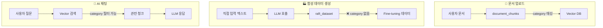
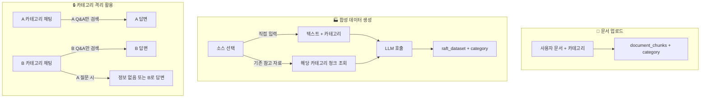

# 🏗️ 카테고리 기반 데이터 격리 아키텍처 설계서

**문서 ID**: 2512281358_Category_Data_Isolation_Design
**작성일**: 2025-12-28
**작성자**: Tech Lead
**버전**: v1.0

---

## 1. 개요 (Executive Summary)

### 1.1 목적

PRISM Writer에서 **카테고리별 완전 격리된 지식 시스템**을 구축합니다.

**핵심 원칙:**

- A 카테고리에서 생성된 Q&A → A 카테고리에서만 활용
- B 카테고리에서 A 관련 질문 → "정보 없음" 또는 B 데이터로만 답변

### 1.2 범위

| 영역                          | 현재 상태             | 변경 필요 |
| ----------------------------- | --------------------- | --------- |
| **document_chunks**           | ✅ category 컬럼 있음 | 없음      |
| **match_document_chunks RPC** | ✅ category 필터 지원 | 없음      |
| **raft_dataset**              | ❌ category 컬럼 없음 | 추가 필요 |
| **합성 데이터 생성 UI**       | ❌ 카테고리 선택 없음 | 추가 필요 |
| **합성 데이터 생성 API**      | ❌ 카테고리 처리 없음 | 추가 필요 |
| **AI 채팅 (RAG)**             | ⚠️ 부분 지원          | 확인 필요 |
| **평가 탭**                   | ⚠️ 부분 지원          | 확인 필요 |

---

## 2. 현재 시스템 분석

### 2.1 데이터 흐름 (As-Is)



### 2.2 기존 카테고리 지원 (document_chunks)

**migration 037_category_scoped_rag.sql:**

- `document_chunks` 테이블에 `category` 컬럼 추가됨 ✅
- `match_document_chunks` RPC에 `category_param` 지원됨 ✅
- 청크 삽입 시 부모 문서 카테고리 자동 상속 트리거 있음 ✅

### 2.3 RAFT Dataset 현재 스키마

```sql
CREATE TABLE public.raft_dataset (
    id UUID PRIMARY KEY DEFAULT gen_random_uuid(),
    created_at TIMESTAMPTZ NOT NULL DEFAULT NOW(),
    updated_at TIMESTAMPTZ NOT NULL DEFAULT NOW(),

    user_query TEXT NOT NULL,      -- 질문
    context TEXT NOT NULL,         -- 참고 자료
    gold_answer TEXT NOT NULL,     -- 정답
    bad_answer TEXT,               -- 오답 (선택)

    source TEXT NOT NULL,          -- 'synthetic', 'user_feedback', 'manual', 'ab_test'
    verified BOOLEAN DEFAULT FALSE,
    model_id TEXT,
    original_feedback_id UUID REFERENCES hallucination_feedback(id)

    -- ❌ category 컬럼 없음!
);
```

---

## 3. 목표 아키텍처 (To-Be)

### 3.1 데이터 흐름



### 3.2 카테고리 격리 원칙

| 시나리오                        | 동작                               |
| ------------------------------- | ---------------------------------- |
| A 카테고리에서 질문, A Q&A 존재 | A Q&A 참조하여 답변 ✅             |
| A 카테고리에서 질문, A Q&A 없음 | "정보가 없습니다" 또는 일반 답변   |
| B 카테고리에서 A 관련 질문      | B Q&A만 검색 → A 정보 접근 불가 ❌ |
| 평가 탭에서 A 문서 평가         | A Q&A만 참조                       |

---

## 4. 상세 변경 사항

### 4.1 Phase 1: 데이터베이스 스키마 변경

**새 마이그레이션: 039_raft_dataset_category.sql**

```sql
-- 1. raft_dataset에 category 컬럼 추가
ALTER TABLE public.raft_dataset
ADD COLUMN IF NOT EXISTS category TEXT DEFAULT '미분류';

-- 2. 인덱스 생성
CREATE INDEX IF NOT EXISTS idx_raft_dataset_category
ON public.raft_dataset(category);

CREATE INDEX IF NOT EXISTS idx_raft_dataset_source_category
ON public.raft_dataset(source, category);

-- 3. 기존 데이터 마이그레이션 (optional)
-- 기존 데이터는 '미분류'로 유지
```

### 4.2 Phase 2: 합성 데이터 생성 UI 수정

**수정 파일: `SyntheticDataPanel.tsx`**

```
┌─────────────────────────────────────────────────────┐
│  ⚙️ 합성 데이터 생성 (RAFT Training Data)           │
├─────────────────────────────────────────────────────┤
│                                                     │
│  📁 카테고리 선택 *                                 │  ← NEW!
│  [마케팅 문서 ▼]                                    │
│                                                     │
│  📚 참고 자료 소스                                  │  ← NEW!
│  ○ 기존 참고 자료 사용 (권장)                       │
│  ○ 직접 텍스트 입력                                 │
│                                                     │
│  [기존 참고 자료 선택 시]                           │
│  ✓ 선택한 카테고리의 모든 청크 사용                 │
│                                                     │
│  [직접 입력 선택 시]                                │
│  ┌─────────────────────────────────────────────┐   │
│  │ 텍스트 입력란 (기존)                         │   │
│  └─────────────────────────────────────────────┘   │
│                                                     │
│  생성 개수: [___10___] 개                           │
│                                                     │
│  ┌─────────────────────────────────────────────┐   │
│  │  🏭 합성 데이터 생성 시작                    │   │
│  └─────────────────────────────────────────────┘   │
│                                                     │
└─────────────────────────────────────────────────────┘
```

**변경 사항:**

1. 카테고리 선택 드롭다운 추가
2. 소스 선택 라디오 버튼 (기존 참고 자료 / 직접 입력)
3. "기존 참고 자료 사용" 선택 시 해당 카테고리의 `document_chunks` 자동 조회
4. 직접 입력 시에도 선택한 카테고리로 태깅

### 4.3 Phase 3: 합성 데이터 생성 API 수정

**수정 파일: `api/raft/generate/route.ts`**

**기존 API 스펙:**

```typescript
POST /api/raft/generate
Body: { context: string, count: number }
```

**신규 API 스펙:**

```typescript
POST /api/raft/generate
Body: {
  context?: string,           // 직접 입력 시 (Optional)
  category: string,           // 카테고리 (Required) ← NEW!
  count: number,
  useExistingChunks?: boolean // true면 DB에서 청크 조회 ← NEW!
}
```

**로직 변경:**

1. `useExistingChunks=true`인 경우:
   - `document_chunks`에서 해당 `category`의 청크들 조회
   - 조회된 청크들을 context로 사용
2. 생성된 Q&A를 `raft_dataset`에 저장할 때 `category` 컬럼 포함

### 4.4 Phase 4: AI 채팅 RAG 카테고리 격리 확인

**확인 필요 파일:** `lib/rag/search.ts`, `api/rag/search/route.ts`

현재 `match_document_chunks` RPC가 `category_param`을 지원하므로:

- 채팅에서 현재 문서의 카테고리를 전달하는지 확인
- 전달 안 하면 → 수정 필요
- 전달하면 → 이미 격리됨 ✅

### 4.5 Phase 5: RAFT 데이터 RAG 통합 (선택적)

향후 Fine-tuning 완료 후, 생성된 Q&A를 RAG 검색에 활용할 경우:

- `raft_dataset`도 Vector 검색 대상에 포함
- 이때 `category` 필터 적용 필수

---

## 5. 구현 체크리스트

### Phase 1: DB 스키마 (예상 30분)

- [ ] P1-01: `039_raft_dataset_category.sql` 마이그레이션 작성
- [ ] P1-02: Supabase에 마이그레이션 적용
- [ ] P1-03: 테이블 변경 확인

### Phase 2: UI 수정 (예상 2시간)

- [ ] P2-01: 카테고리 목록 조회 API/함수 확인
- [ ] P2-02: `SyntheticDataPanel.tsx`에 카테고리 선택 UI 추가
- [ ] P2-03: 소스 선택 라디오 버튼 추가 (기존 참고 자료 / 직접 입력)
- [ ] P2-04: "기존 참고 자료 사용" 시 context 입력란 숨김/비활성화
- [ ] P2-05: 유효성 검증 로직 수정

### Phase 3: API 수정 (예상 1.5시간)

- [ ] P3-01: API 스펙 변경 (category, useExistingChunks 파라미터)
- [ ] P3-02: useExistingChunks=true 시 청크 조회 로직 추가
- [ ] P3-03: raft_dataset 저장 시 category 포함
- [ ] P3-04: lib/api/raft.ts 클라이언트 함수 수정

### Phase 4: RAG 격리 확인 (예상 1시간)

- [ ] P4-01: 채팅 API에서 category 전달 여부 확인
- [ ] P4-02: 필요 시 category 전달 로직 추가
- [ ] P4-03: 격리 테스트 (A 카테고리에서 B 정보 접근 불가 확인)

### Phase 5: 종합 검증 (예상 1시간)

- [ ] P5-01: 전체 플로우 통합 테스트
- [ ] P5-02: 카테고리 격리 시나리오 테스트
- [ ] P5-03: 회귀 테스트 (기존 기능 정상 동작)

---

## 6. 예상 소요 시간

| Phase    | 작업           | 예상 시간    |
| -------- | -------------- | ------------ |
| Phase 1  | DB 스키마 변경 | 30분         |
| Phase 2  | UI 수정        | 2시간        |
| Phase 3  | API 수정       | 1.5시간      |
| Phase 4  | RAG 격리 확인  | 1시간        |
| Phase 5  | 종합 검증      | 1시간        |
| **합계** |                | **약 6시간** |

---

## 7. 리스크 및 완화 방안

| 리스크                                 | 영향도 | 완화 방안                |
| -------------------------------------- | ------ | ------------------------ |
| 기존 raft_dataset 데이터 카테고리 없음 | 중간   | '미분류' 기본값으로 처리 |
| 청크 조회 성능 저하                    | 낮음   | category 인덱스로 해결   |
| 채팅 API 카테고리 미전달               | 높음   | Phase 4에서 확인 및 수정 |

---

## 8. 롤백 계획

문제 발생 시:

1. **Feature Flag**: `ENABLE_RAFT_FEATURES=false`로 전체 기능 비활성화
2. **DB 롤백**: category 컬럼은 유지 (데이터 손실 없음)
3. **UI 롤백**: 이전 커밋으로 revert

---

## 9. 다음 단계 (Action Items)

1. ✅ 디렉터님 설계 검토 및 승인
2. ⏳ 승인 후 Phase 1부터 순차 진행
3. ⏳ 각 Phase 완료 후 검증 → 다음 Phase 진행

---

_작성 완료: Tech Lead (2025-12-28)_
