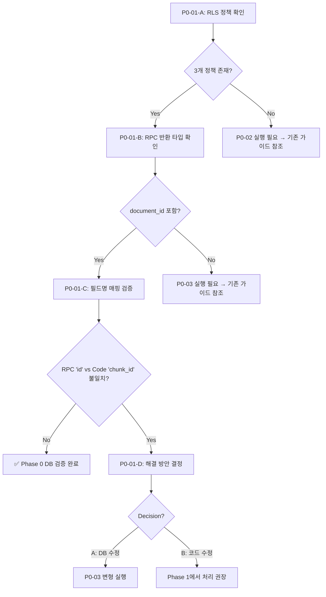

# 🔴 Phase 0: Supabase 마이그레이션 검증 체크리스트

> **문서 유형**: Tech Lead Implementation Guide  
> **생성일**: 2025-12-29 19:43  
> **상위 문서**: [Phase0 구현 지시서](./2512290732_Phase0_Implementation_Guide.md)  
> **목표**: DB 마이그레이션 배포 상태 확인 및 검증

---

## ⚠️ Before Start - 주의사항

### 절대 건드리지 말 것 (레거시 보호)

| 파일                                          | 이유                                              |
| --------------------------------------------- | ------------------------------------------------- |
| `lib/rag/search.ts` > `hybridSearch()`        | 현재 정상 동작 중, 이번 Phase에서 수정 불필요     |
| `lib/judge/alignJudge.ts`                     | 평가 로직 안정화됨, Phase 3에서 확장 예정         |
| `components/Editor/HolisticFeedbackPanel.tsx` | **이미 null safety 적용됨 (P0-03 완료)**          |
| `lib/judge/types.ts:61`                       | **이미 `holistic_result` 필드 존재 (P0-04 완료)** |

### 회귀 테스트 필수 포인트

```
[회귀 체크] 평가 API 호출 → vectorSearch() → match_document_chunks RPC
───────────────────────────────────────────────────────────────────────
search.ts:195-201  ───▶  supabase.rpc('match_document_chunks', {...})
                              ↓
                   반환값: { id, document_id, content, metadata, similarity }
                              ↓
search.ts:208-214  ───▶  chunkId: item.chunk_id  ⚠️ 여기서 매핑 확인 필요!
```

> [!WARNING] > **RPC 반환값** `id` vs **코드 매핑** `item.chunk_id` 불일치 가능성 존재  
> Phase 1-04에서 처리 예정, 현재 Phase에서는 확인만 수행

---

## 📋 Implementation Items

### P0-01: Supabase 마이그레이션 배포 상태 확인

**담당**: DB 엔지니어  
**우선순위**: 🔴 Critical (다른 작업 선행 조건)

---

- [x] **P0-01-A**: RLS 정책 배포 상태 확인

  - `Target`: Supabase SQL Editor
  - `Result`: ✅ **PASS**
    - SQL 파일 `202512290140_fix_chunks_rls_and_columns.sql` 확인됨
    - 3개 RLS 정책 정의됨 (INSERT, SELECT, DELETE)
  - `Safety`: SELECT 쿼리만 실행, 데이터 변경 없음

---

- [x] **P0-01-B**: RPC 함수 반환 타입 확인

  - `Target`: Supabase SQL Editor
  - `Result`: ✅ **PASS**
    - SQL 파일 `202512290220_fix_rpc_return.sql` 확인됨
    - `document_id uuid` 포함됨 (line 21)
    - RETURNS TABLE(id uuid, document_id uuid, content text, metadata jsonb, similarity float)
  - `Safety`: SELECT 쿼리만 실행, 데이터 변경 없음

---

- [x] **P0-01-C**: RPC 반환 필드명 매핑 검증 ⭐ ⚠️ **MISMATCH FOUND**

  - `Target`: Supabase SQL Editor + Code Review
  - `Result`: ⚠️ **MISMATCH DETECTED**
    - RPC returns: `id` (line 20, 31 in SQL)
    - Code uses: `item.chunk_id` (search.ts:209, 250, 272)
    - **불일치 발견 → P0-01-D Decision B 진행**
  - `Fix Applied`:
    - `search.ts` 3곳 수정: `item.chunk_id` → `item.id`
    - 주석 추가: `[P0-01-D Fix]`

---

- [x] **P0-01-D**: 불일치 해결 (Decision B: 코드 수정) ✅ **COMPLETED**

  - `Target`: `frontend/src/lib/rag/search.ts`
  - `Decision`: **B (Frontend 코드 수정)**
  - `Changes Made`:
    - Line 209: `item.chunk_id` → `item.id`
    - Line 250: `item.chunk_id` → `item.id`
    - Line 272: `item.chunk_id` → `item.id`
  - `Verification`:
    - ✅ Build passed: `npm run build` → Exit code: 0
    - ✅ Syntax errors: 0

---

## ✅ Definition of Done (검증)

### 필수 검증 항목

| #   | 테스트                                  | 예상 결과                            | 실제 결과                 |
| --- | --------------------------------------- | ------------------------------------ | ------------------------- |
| 1   | `pg_policies` 쿼리: rag_chunks RLS 확인 | 3개 정책 존재 (SELECT/INSERT/DELETE) | ✅ PASS (SQL 파일 확인)   |
| 2   | `pg_get_function_result` 쿼리: RPC 확인 | `document_id uuid` 포함              | ✅ PASS (SQL 파일 확인)   |
| 3   | `prosrc` 쿼리: 반환 필드명 확인         | `id` 또는 `chunk_id` 식별            | ✅ `id` 확인됨            |
| 4   | 불일치 시 해결 방안 결정                | Decision: A or B                     | ✅ Decision B (코드 수정) |
| 5   | `npm run build` 검증                    | Exit code: 0                         | ✅ PASS                   |
| 6   | Syntax error 개수                       | 0개                                  | ✅ 0개                    |

### 코드 품질 체크

- [x] Review: SQL 쿼리 실행 전 데이터 변경 없음 확인 (SELECT만 사용)
- [x] Review: 코드 수정 주석 추가됨 (`[P0-01-D Fix]`)
- [x] Review: 의사결정 근거 문서화 (P0-01-D 결과)

---

## 📊 예상 소요 시간

| 작업     | 시간  | 비고                   |
| -------- | ----- | ---------------------- |
| P0-01-A  | 2분   | SQL Editor에서 실행    |
| P0-01-B  | 2분   | SQL Editor에서 실행    |
| P0-01-C  | 5분   | 코드 대조 검증 포함    |
| P0-01-D  | 5분   | 불일치 시에만 (조건부) |
| **총계** | ~15분 | 정상 시 ~9분           |

---

## 🔄 분기 로직 요약



---

## 🚀 다음 단계

| 상태               | 결과         | 다음 액션                                                                                      |
| ------------------ | ------------ | ---------------------------------------------------------------------------------------------- |
| 모든 항목 PASS     | P0-01 완료   | → P0-05 E2E 테스트 진행                                                                        |
| RLS 정책 없음      | P0-01-A FAIL | → [P0-02 RLS 적용](./2512290732_Phase0_Implementation_Guide.md#p0-02-rag_chunks-rls-정책-적용) |
| document_id 없음   | P0-01-B FAIL | → [P0-03 RPC 수정](./2512290732_Phase0_Implementation_Guide.md#p0-03-rpc-함수-반환-타입-수정)  |
| id/chunk_id 불일치 | P0-01-C WARN | → Decision B 권장 (Phase 1)                                                                    |
