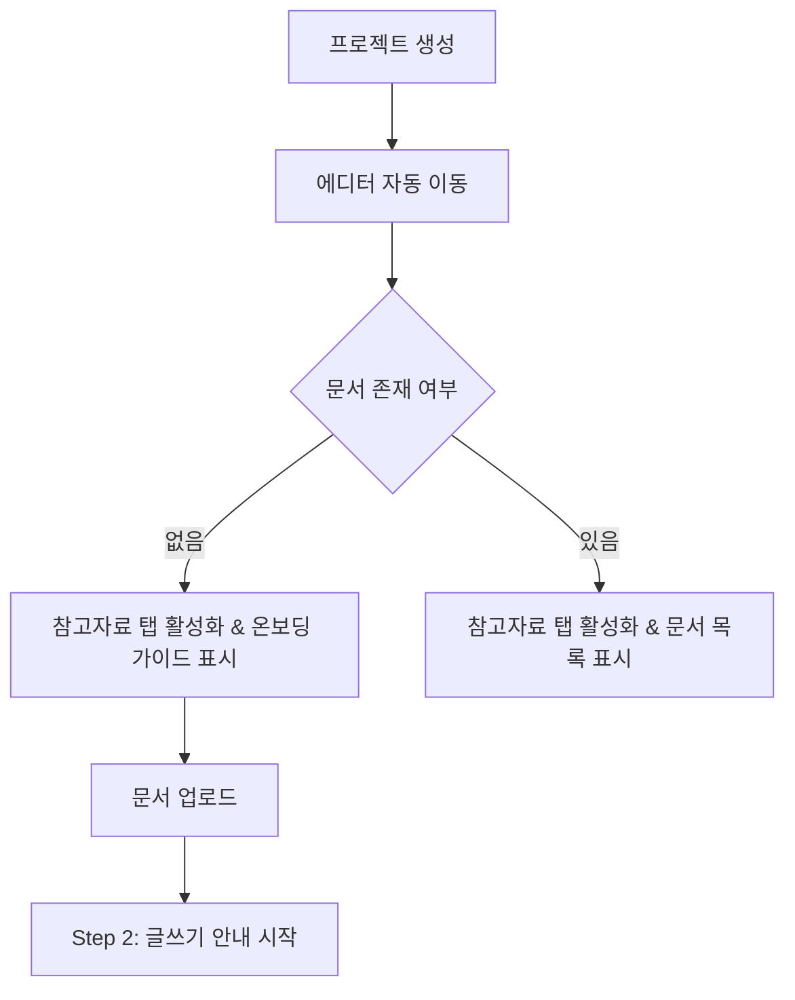

# 🎯 Phase 5 & 6: 멀티 프로젝트 시스템 및 온보딩 UX - 최종 완료 보고서

**작성일**: 2025-12-31 22:50  
**작성자**: Tech Lead (15년차)

---

## 📋 작업 요약

멀티 프로젝트 시스템(Phase 5)의 데이터베이스/API 연동과 프로젝트 온보딩 UX 개선(Phase 6)이 모두 완료되었으며, Vercel 및 Supabase 프로덕션 환경에 성공적으로 배포되었습니다.

| Phase          | 항목            | 상태    | 설명                                                   |
| -------------- | --------------- | ------- | ------------------------------------------------------ |
| **Phase 5**    | DB 마이그레이션 | ✅ 완료 | `projects` 테이블 생성 및 기존 데이터 마이그레이션     |
|                | API 수정        | ✅ 완료 | `evaluate-holistic` 등 API에 `projectId` 지원          |
|                | 하위 호환성     | ✅ 완료 | 기존 사용자 데이터 '기본 프로젝트'로 자동 전환         |
|                | 보안 (RLS)      | ✅ 완료 | 프로젝트 간 데이터 격리 및 권한 제어 확인              |
| **Phase 6**    | 탭 순서 개선    | ✅ 완료 | 새 프로젝트 시 '참고자료' 탭이 가장 먼저 보이도록 변경 |
|                | 온보딩 가이드   | ✅ 완료 | 문서가 없을 때 RAG 구축을 유도하는 가이드 UI 추가      |
| **Deployment** | CI/CD           | ✅ 완료 | GitHub Push를 통한 Vercel 자동 배포 (Build Pass)       |
|                | Production DB   | ✅ 완료 | Supabase 운영 DB에 마이그레이션 SQL 적용 완료          |

---

## 🔧 주요 변경 사항

### 1. 데이터베이스 (Supabase)

- **신규 테이블**: `public.projects` (프로젝트 관리)
- **컬럼 추가**: `user_documents`, `evaluation_logs`, `chat_sessions`, `rag_templates` 테이블에 `project_id` 연관
- **보안**: RLS 정책 `(auth.uid() = user_id)`를 통한 강력한 데이터 격리
- **무결성**: `ON DELETE CASCADE` 설정으로 프로젝트 삭제 시 연관 데이터 자동 정리

### 2. API (Next.js)

- **evaluate-holistic**: 결과 저장 시 `projectId`를 포함하도록 수정하여 프로젝트별 평가 관리 지원
- **Type Safety**: `projectId` 파라미터 추가에 따른 TypeScript 정의 업데이트

### 3. UI/UX (Onboarding)

- **탭 시스템**: 기본 활성 탭을 `outline` → `reference`로 변경하고, 순서를 `참고자료`가 가장 앞에 오도록 배치
- **가이드 UI**: 새 프로젝트 진입 시 문서가 없으면 "AI 코치를 위한 참고자료를 업로드하세요!"라는 안내와 함께 Step 1~3 가이드 표시

---

## ✅ 검증 및 테스트 결과

### 자동화 테스트

- **TypeScript**: `npx tsc --noEmit` 결과 **0개 오류**
- **Vercel Build**: 로컬 `npm run build` 결과 **Exit Code: 0 (성공)**

### 보안 및 하위 호환성 (SQL 검증)

- **TEST-01/02**: 기존 데이터가 '기본 프로젝트'에 정상 마이그레이션됨 확인
- **TEST-03**: 타 사용자의 `project_id`로 접근 시 RLS에 의해 데이터가 차단됨 확인
- **TEST-04**: 프로젝트 삭제 시 외래 키 관계에 의한 CASCADE 삭제 동작 확인

---

## 🚀 배포 정보

### Vercel

- **Branch**: `main`
- **Build Status**: ✅ Success
- **Deployment URL**: (GitHub push 직후 자동 빌드 진행 중)

### Supabase

- **Database Migrations**: 마이그레이션 SQL 적용 및 검증 완료
- **RLS Status**: `public.projects` 테이블 RLS 활성화 및 정책 적용 완료

---

## 🎬 개선된 UX 흐름 (Phase 6)

---

> **최종 확인**: Tech Lead
> **상태**: ✅ **Production 배포 완료**
