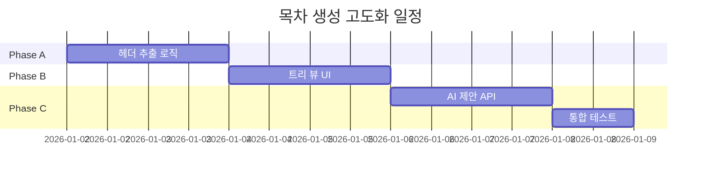

# 목차 생성 고도화 설계 문서

> **문서 ID**: 2601011839_Outline_Generator_Enhancement  
> **작성일**: 2026-01-01  
> **우선순위**: 1순위 (권장)  
> **예상 소요**: 1주일  
> **필요 인프라**: 없음 (순수 코드 작업)

---

## 1. 현재 상태

### 1.1 기존 구현

- `OutlineTab.tsx`: 단순 RAG 기반 목차 제안
- 사용자가 입력한 주제에 대해 AI가 목차를 생성
- 업로드된 문서의 구조를 분석하지 않음

### 1.2 문제점

| 문제           | 설명                                     |
| :------------- | :--------------------------------------- |
| 문서 구조 무시 | 업로드된 참고자료의 헤더 구조 활용 안 함 |
| 단방향 흐름    | AI 제안 → 사용자 수용만 가능             |
| 맥락 부족      | 에디터 내용과 연동 없음                  |

---

## 2. 목표

### 2.1 HMW (How Might We)

> _"어떻게 하면 사용자가 참고자료의 구조를 바탕으로 더 나은 글 구조를 잡을 수 있을까?"_

### 2.2 핵심 목표

1. **문서 헤더 자동 추출**: 업로드된 문서의 #, ##, ### 헤더 분석
2. **구조화된 목차 시각화**: 트리 형태로 목차 표시
3. **AI 보완 제안**: 누락된 섹션 추천

---

## 3. 기능 상세

### 3.1 Phase A: 문서 헤더 추출 (2일)

```
[업로드된 문서]           [추출된 헤더]
# 서론                 →  depth: 1, title: "서론"
## 배경                →  depth: 2, title: "배경"
## 목적                →  depth: 2, title: "목적"
# 본론                 →  depth: 1, title: "본론"
```

**구현 위치**: `frontend/src/lib/rag/outlineExtractor.ts` (신규)

**주요 로직**:

```typescript
interface ExtractedHeader {
  depth: number; // 1 = #, 2 = ##, 3 = ###
  title: string;
  documentId: string;
  position: number; // 문서 내 위치 (줄 번호)
}

function extractHeaders(content: string): ExtractedHeader[];
```

### 3.2 Phase B: 목차 시각화 UI (2일)

**기존 OutlineTab 확장**:

- 좌측: 문서별 헤더 트리 뷰
- 우측: 현재 에디터 목차 구조
- 드래그 앤 드롭으로 참고 목차 → 에디터 목차 복사

**UI 목업**:

```
┌─────────────────────────────────────────┐
│ 📚 참고자료 목차      │ ✍️ 내 글 목차    │
├─────────────────────────────────────────┤
│ 📄 논문A.pdf          │ # 서론          │
│   ├─ # 서론           │   └─ ## 배경    │
│   │   └─ ## 배경      │ # 본론          │
│   │   └─ ## 목적      │   └─ (비어있음) │
│   └─ # 본론           │ # 결론          │
│                       │                 │
│ 📄 보고서B.md         │ [+ AI 제안받기] │
│   └─ ...              │                 │
└─────────────────────────────────────────┘
```

### 3.3 Phase C: AI 보완 제안 (3일)

**RAG + LLM 활용**:

1. 참고 문서들의 공통 구조 분석
2. 현재 에디터 목차와 비교
3. 누락된 섹션 제안

**프롬프트 예시**:

```
다음 참고자료들의 목차 구조를 분석하고,
사용자의 현재 목차에서 누락된 섹션을 제안해주세요.

[참고자료 목차]
- 논문A: 서론 > 배경, 목적 / 본론 > 방법론, 결과 / 결론
- 보고서B: 개요 / 현황 분석 / 개선방안 / 기대효과

[현재 목차]
- 서론 > 배경
- 결론

[제안 형식]
1. 추가 권장: "본론" 섹션 (참고: 논문A)
2. 추가 권장: "목적" 섹션 (서론 하위)
```

---

## 4. 파일 변경 목록

| 파일                                       | 변경 유형 | 설명             |
| :----------------------------------------- | :-------: | :--------------- |
| `lib/rag/outlineExtractor.ts`              |   신규    | 헤더 추출 로직   |
| `components/Assistant/OutlineTab.tsx`      |   수정    | UI 확장          |
| `components/Assistant/OutlineTreeView.tsx` |   신규    | 트리 뷰 컴포넌트 |
| `app/api/outline/suggest/route.ts`         |   신규    | AI 제안 API      |
| `hooks/useOutline.ts`                      |   신규    | 목차 상태 관리   |

---

## 5. 검증 계획

### 5.1 단위 테스트

- `outlineExtractor.ts`: 다양한 마크다운 형식 파싱 테스트
- 한글/영문 헤더 혼합 테스트

### 5.2 통합 테스트

- 문서 업로드 → 헤더 추출 → UI 표시 흐름
- AI 제안 정확도 평가 (샘플 문서 10건)

### 5.3 UX 테스트

- 드래그 앤 드롭 반응성
- 트리 뷰 접기/펼치기

---

## 6. 리스크 및 대응

| 리스크         | 확률 | 대응 방안              |
| :------------- | :--: | :--------------------- |
| 비정형 헤더    |  중  | 정규식 + 휴리스틱 조합 |
| AI 제안 부정확 |  중  | 신뢰도 점수 표시       |
| 성능 저하      |  저  | 헤더 추출 결과 캐싱    |

---

## 7. 예상 일정



---

## 8. 결론

**장점:**

- 인프라 설정 불필요, 즉시 개발 가능
- PRISM Writer 핵심 가치 강화
- Phase 8 (드래그 앤 드롭)과 자연스러운 연동

**단점:**

- AI 제안 품질 보장 어려움 (지속적 튜닝 필요)
- UI 복잡도 증가

**추천 여부: ⭐⭐⭐⭐⭐ (강력 추천)**
