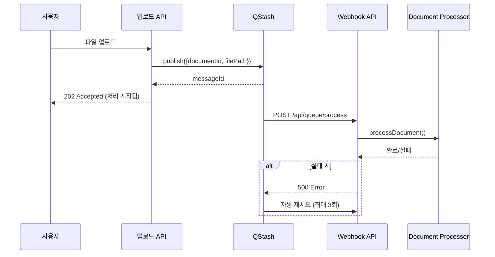
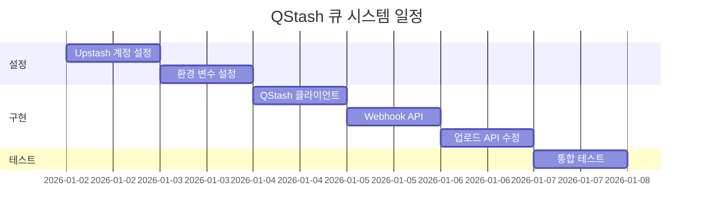

# QStash 큐 시스템 설계 문서

> **문서 ID**: 2601011839_QStash_Queue_System  
> **작성일**: 2026-01-01  
> **우선순위**: 2순위  
> **예상 소요**: 2일  
> **필요 인프라**: Upstash 계정 (무료 티어 가능)

---

## 1. 현재 상태

### 1.1 기존 구현

```typescript
// documentProcessor.ts (현재)
export async function triggerDocumentProcessing(...) {
  // 백그라운드 처리를 위해 await 하지 않음
  // Vercel Serverless 함수 시간 제한 고려
  processDocument(documentId, filePath, userId)
    .then(result => { ... })
    .catch(err => { ... })
}
```

### 1.2 문제점

| 문제             | 심각도 | 설명                                          |
| :--------------- | :----: | :-------------------------------------------- |
| 처리 보장 없음   |  높음  | Vercel 함수 종료 시 백그라운드 작업 중단 가능 |
| 재시도 없음      |  중간  | 실패 시 수동 재처리 필요                      |
| 상태 추적 불가   |  중간  | 처리 중인 문서 수, 대기열 확인 불가           |
| 동시성 제어 없음 |  낮음  | 대량 업로드 시 API 과부하 가능                |

---

## 2. 목표

### 2.1 핵심 목표

1. **안정적인 백그라운드 처리**: 함수 종료와 무관하게 작업 완료 보장
2. **자동 재시도**: 실패 시 최대 3회 자동 재시도
3. **처리 상태 가시성**: 대기열 상태 모니터링

### 2.2 기대 효과

- 문서 처리 성공률: 95% → 99%+
- 사용자 경험 개선: "처리 중" 상태 신뢰도 향상

---

## 3. 기술 스택

### 3.1 Upstash QStash

- **선택 이유**: Vercel 친화적, 서버리스 환경 최적화
- **가격**: 무료 티어 500 메시지/일, $1/1000 메시지
- **특징**: HTTP 기반, 자동 재시도, 예약 발송

### 3.2 대안 비교

| 서비스     | 장점                | 단점           |
| :--------- | :------------------ | :------------- |
| **QStash** | Vercel 최적화, 간단 | Upstash 종속   |
| Inngest    | 복잡한 워크플로우   | 학습 곡선 높음 |
| AWS SQS    | 확장성              | 설정 복잡      |

---

## 4. 아키텍처

### 4.1 현재 vs 개선

```
[현재]
업로드 → API Route → processDocument() (불안정)
                          ↓
                     (Vercel 함수 종료 시 중단 가능)

[개선]
업로드 → API Route → QStash.publish() → Webhook → processDocument()
                          ↓                           ↓
                     (즉시 응답)              (별도 함수에서 안전하게 처리)
```

### 4.2 시퀀스 다이어그램



---

## 5. 구현 상세

### 5.1 환경 변수 설정

```env
# .env.local
QSTASH_TOKEN=your_qstash_token
QSTASH_CURRENT_SIGNING_KEY=your_signing_key
QSTASH_NEXT_SIGNING_KEY=your_next_signing_key
```

### 5.2 QStash 클라이언트 설정

**파일**: `frontend/src/lib/queue/qstash.ts` (신규)

```typescript
import { Client } from "@upstash/qstash";

export const qstash = new Client({
  token: process.env.QSTASH_TOKEN!,
});

export interface DocumentProcessJob {
  documentId: string;
  filePath: string;
  userId: string;
  fileType?: string;
  retryCount?: number;
}

export async function enqueueDocumentProcessing(job: DocumentProcessJob) {
  const webhookUrl = `${process.env.NEXT_PUBLIC_APP_URL}/api/queue/process`;

  return await qstash.publishJSON({
    url: webhookUrl,
    body: job,
    retries: 3,
    delay: "0s",
  });
}
```

### 5.3 Webhook API 엔드포인트

**파일**: `frontend/src/app/api/queue/process/route.ts` (신규)

```typescript
import { verifySignatureAppRouter } from "@upstash/qstash/nextjs";
import { processDocument } from "@/lib/rag/documentProcessor";

async function handler(request: Request) {
  const job = await request.json();

  const result = await processDocument(
    job.documentId,
    job.filePath,
    job.userId,
    job.fileType
  );

  if (!result.success) {
    // QStash가 자동 재시도하도록 500 반환
    return new Response(result.error, { status: 500 });
  }

  return new Response("OK", { status: 200 });
}

// QStash 서명 검증 미들웨어
export const POST = verifySignatureAppRouter(handler);
```

### 5.4 업로드 API 수정

**파일**: `frontend/src/app/api/documents/upload/route.ts` (수정)

```typescript
// Before
await triggerDocumentProcessing(documentId, filePath, userId);

// After
import { enqueueDocumentProcessing } from "@/lib/queue/qstash";

await enqueueDocumentProcessing({
  documentId,
  filePath,
  userId,
  fileType,
});
```

---

## 6. 파일 변경 목록

| 파일                                | 변경 유형 | 설명                   |
| :---------------------------------- | :-------: | :--------------------- |
| `lib/queue/qstash.ts`               |   신규    | QStash 클라이언트      |
| `app/api/queue/process/route.ts`    |   신규    | Webhook 엔드포인트     |
| `app/api/documents/upload/route.ts` |   수정    | 큐 발행으로 변경       |
| `package.json`                      |   수정    | `@upstash/qstash` 추가 |
| `.env.local`                        |   수정    | QStash 환경 변수 추가  |

---

## 7. 인프라 설정 가이드

### 7.1 Upstash 계정 생성

1. https://console.upstash.com 접속
2. 회원가입 (GitHub 로그인 가능)
3. QStash 메뉴 → API Keys 복사

### 7.2 Vercel 환경 변수 설정

1. Vercel Dashboard → 프로젝트 → Settings → Environment Variables
2. 다음 변수 추가:
   - `QSTASH_TOKEN`
   - `QSTASH_CURRENT_SIGNING_KEY`
   - `QSTASH_NEXT_SIGNING_KEY`

### 7.3 비용 예측

| 사용량                  | 월 비용 |
| :---------------------- | ------: |
| 500 문서/일 (무료 티어) |      $0 |
| 1,000 문서/일           |    ~$15 |
| 5,000 문서/일           |    ~$75 |

---

## 8. 검증 계획

### 8.1 기능 테스트

- [ ] 정상 문서 업로드 → 처리 완료
- [ ] 대용량 PDF (10MB) 처리
- [ ] 동시 5개 문서 업로드

### 8.2 장애 테스트

- [ ] 의도적 처리 실패 → 자동 재시도 확인
- [ ] Webhook 타임아웃 → 재시도 확인

### 8.3 모니터링

- Upstash Console → QStash → Messages 탭에서 처리 상태 확인

---

## 9. 리스크 및 대응

| 리스크              | 확률 | 대응 방안                 |
| :------------------ | :--: | :------------------------ |
| Upstash 서비스 장애 | 낮음 | 기존 동기 처리로 폴백     |
| 서명 검증 실패      | 낮음 | 로깅 강화, 키 갱신 자동화 |
| 비용 초과           | 중간 | 사용량 알림 설정          |

---

## 10. 예상 일정



---

## 11. 결론

**장점:**

- 문서 처리 안정성 대폭 향상
- 자동 재시도로 실패율 감소
- 처리 상태 모니터링 가능

**단점:**

- 외부 서비스 의존성 추가
- 비용 발생 가능 (대량 사용 시)
- 로컬 개발 환경 설정 필요

**추천 여부: ⭐⭐⭐⭐☆ (강력 추천, 인프라 설정 필요)**
