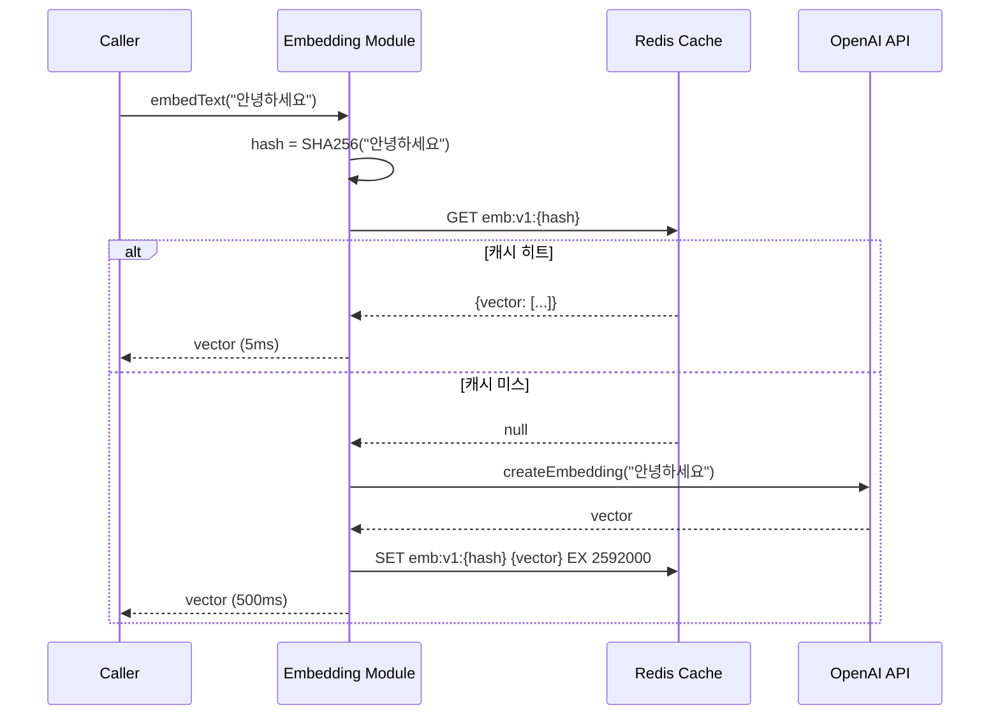
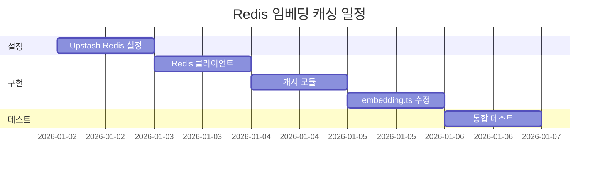

# Redis 임베딩 캐싱 설계 문서

> **문서 ID**: 2601011839_Redis_Embedding_Cache  
> **작성일**: 2026-01-01  
> **우선순위**: 3순위  
> **예상 소요**: 2일  
> **필요 인프라**: Upstash Redis (무료 티어 가능)

---

## 1. 현재 상태

### 1.1 기존 구현

- 임베딩 생성: `frontend/src/lib/rag/embedding.ts`
- 캐싱 없음: 동일 텍스트도 매번 API 호출

### 1.2 문제점

| 문제           | 영향 | 설명                                |
| :------------- | :--: | :---------------------------------- |
| 중복 API 호출  | 비용 | 동일 청크 재임베딩 시 불필요한 비용 |
| 응답 지연      | 성능 | 임베딩 API 호출 ~500ms/배치         |
| 일일 한도 소진 | 제한 | 반복 처리 시 사용량 빠른 소진       |

### 1.3 현재 비용 구조

```
텍스트 → OpenAI Embedding API → 벡터
         (매번 호출, $0.0001/1K tokens)
```

---

## 2. 목표

### 2.1 핵심 목표

1. **중복 임베딩 제거**: 동일 텍스트 해시 기반 캐시
2. **응답 속도 개선**: 캐시 히트 시 ~5ms (100배 개선)
3. **비용 절감**: 캐시 히트율 70% 목표 → 비용 70% 절감

### 2.2 기대 효과

| 지표           | 현재  | 목표  |
| :------------- | :---: | :---: |
| 캐시 히트율    |  0%   | 70%+  |
| 평균 응답 시간 | 500ms | 150ms |
| 월 임베딩 비용 |  $X   | $0.3X |

---

## 3. 기술 스택

### 3.1 Upstash Redis

- **선택 이유**: Serverless 친화적, Vercel Edge 지원
- **가격**: 무료 티어 10,000 commands/day
- **특징**: REST API, 글로벌 복제

### 3.2 대안 비교

| 서비스            | 장점              | 단점           |
| :---------------- | :---------------- | :------------- |
| **Upstash Redis** | Serverless 최적화 | 무료 티어 제한 |
| Vercel KV         | Vercel 통합       | 비용 높음      |
| AWS ElastiCache   | 고성능            | 설정 복잡      |

---

## 4. 아키텍처

### 4.1 캐싱 전략

```
[캐시 키 생성]
텍스트 → SHA-256 해시 → "emb:v1:{hash}"

[캐시 조회 흐름]
1. 텍스트 해시 계산
2. Redis에서 캐시 조회
3-A. 캐시 히트 → 벡터 반환 (5ms)
3-B. 캐시 미스 → API 호출 → 캐시 저장 → 벡터 반환 (500ms)
```

### 4.2 데이터 구조

```typescript
// Redis Key
"emb:v1:{sha256_hash}"

// Redis Value (JSON)
{
  "vector": [0.123, -0.456, ...],  // 1536 dimensions
  "model": "text-embedding-3-small",
  "createdAt": "2026-01-01T00:00:00Z"
}

// TTL: 30일 (모델 버전 변경 대비)
```

### 4.3 시퀀스 다이어그램



---

## 5. 구현 상세

### 5.1 환경 변수 설정

```env
# .env.local
UPSTASH_REDIS_REST_URL=https://xxx.upstash.io
UPSTASH_REDIS_REST_TOKEN=your_token
```

### 5.2 Redis 클라이언트

**파일**: `frontend/src/lib/cache/redis.ts` (신규)

```typescript
import { Redis } from "@upstash/redis";

export const redis = new Redis({
  url: process.env.UPSTASH_REDIS_REST_URL!,
  token: process.env.UPSTASH_REDIS_REST_TOKEN!,
});

// 임베딩 캐시 TTL (30일)
export const EMBEDDING_CACHE_TTL = 60 * 60 * 24 * 30;
```

### 5.3 임베딩 캐시 모듈

**파일**: `frontend/src/lib/cache/embeddingCache.ts` (신규)

```typescript
import { redis, EMBEDDING_CACHE_TTL } from "./redis";
import crypto from "crypto";

const CACHE_PREFIX = "emb:v1:";

interface CachedEmbedding {
  vector: number[];
  model: string;
  createdAt: string;
}

function hashText(text: string): string {
  return crypto.createHash("sha256").update(text).digest("hex");
}

export async function getCachedEmbedding(
  text: string
): Promise<number[] | null> {
  const key = CACHE_PREFIX + hashText(text);
  const cached = await redis.get<CachedEmbedding>(key);
  return cached?.vector ?? null;
}

export async function setCachedEmbedding(
  text: string,
  vector: number[],
  model: string
): Promise<void> {
  const key = CACHE_PREFIX + hashText(text);
  await redis.set(
    key,
    {
      vector,
      model,
      createdAt: new Date().toISOString(),
    },
    { ex: EMBEDDING_CACHE_TTL }
  );
}

export async function getCachedEmbeddingsBatch(
  texts: string[]
): Promise<(number[] | null)[]> {
  const keys = texts.map((t) => CACHE_PREFIX + hashText(t));
  const results = await redis.mget<CachedEmbedding[]>(...keys);
  return results.map((r) => r?.vector ?? null);
}
```

### 5.4 embedding.ts 수정

**파일**: `frontend/src/lib/rag/embedding.ts` (수정)

```typescript
import {
  getCachedEmbedding,
  setCachedEmbedding,
} from "@/lib/cache/embeddingCache";

export async function embedText(text: string): Promise<number[]> {
  // 1. 캐시 확인
  const cached = await getCachedEmbedding(text);
  if (cached) {
    console.log("[Embedding] Cache hit");
    return cached;
  }

  // 2. API 호출
  console.log("[Embedding] Cache miss, calling API");
  const vector = await callOpenAIEmbedding(text);

  // 3. 캐시 저장 (비동기, 응답 지연 방지)
  setCachedEmbedding(text, vector, EMBEDDING_CONFIG.modelId).catch(
    console.error
  );

  return vector;
}
```

---

## 6. 파일 변경 목록

| 파일                          | 변경 유형 | 설명                  |
| :---------------------------- | :-------: | :-------------------- |
| `lib/cache/redis.ts`          |   신규    | Redis 클라이언트      |
| `lib/cache/embeddingCache.ts` |   신규    | 임베딩 캐시 로직      |
| `lib/rag/embedding.ts`        |   수정    | 캐시 통합             |
| `package.json`                |   수정    | `@upstash/redis` 추가 |
| `.env.local`                  |   수정    | Redis 환경 변수 추가  |

---

## 7. 인프라 설정 가이드

### 7.1 Upstash Redis 생성

1. https://console.upstash.com 접속
2. Redis 메뉴 → Create Database
3. Region: ap-northeast-1 (Tokyo) 권장
4. REST API Keys 복사

### 7.2 비용 예측

| 사용량                     | 월 비용 |
| :------------------------- | ------: |
| 10,000 commands/day (무료) |      $0 |
| 100,000 commands/day       |    ~$10 |
| 1M commands/day            |    ~$50 |

---

## 8. 검증 계획

### 8.1 기능 테스트

- [ ] 동일 텍스트 2회 임베딩 → 2회차 캐시 히트
- [ ] 배치 임베딩 캐시 테스트
- [ ] TTL 만료 후 재생성

### 8.2 성능 테스트

- [ ] 캐시 히트 응답 시간 < 10ms
- [ ] 캐시 미스 시 기존과 동일

### 8.3 모니터링

- Upstash Console → Redis → Metrics에서 히트율 확인

---

## 9. 리스크 및 대응

| 리스크      | 확률 | 대응 방안                        |
| :---------- | :--: | :------------------------------- |
| 캐시 불일치 | 낮음 | 모델 버전 prefix로 분리          |
| Redis 장애  | 낮음 | 캐시 미스로 처리 (API 직접 호출) |
| 메모리 초과 | 중간 | TTL 단축, eviction 정책          |

---

## 10. 예상 일정



---

## 11. 결론

**장점:**

- 임베딩 API 비용 최대 70% 절감
- 응답 속도 대폭 개선
- 일일 사용량 한도 부담 감소

**단점:**

- 외부 서비스 의존성 추가
- 캐시 무효화 전략 필요
- Redis 비용 발생 (대량 사용 시)

**추천 여부: ⭐⭐⭐⭐☆ (추천, 비용 절감 효과 큼)**

> **Note**: QStash와 동일한 Upstash 계정에서 Redis도 생성 가능합니다.
> 두 기능을 함께 도입하면 관리 편의성이 높습니다.
