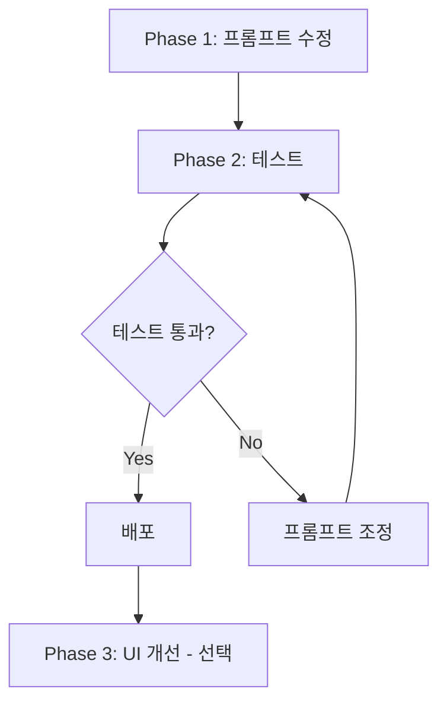

# Citation Feature Implementation Plan

## PRISM Writer - RAG 인용 표기 시스템 구현 계획서

| 항목   | 내용                   |
| ------ | ---------------------- |
| 작성일 | 2026-01-03             |
| 작성자 | PRISM Development Team |
| 버전   | 1.0                    |
| 상태   | 검토 대기              |

---

## 1. 개요

### 1.1 목적

RAG 시스템에서 참고 자료를 기반으로 답변할 때, **명확한 출처 표기**를 통해 신뢰성을 높이고 할루시네이션을 방지합니다.

### 1.2 구현 범위

| 기능                            | 설명                                | 우선순위  |
| ------------------------------- | ----------------------------------- | --------- |
| **인용 마커 (Citation Marker)** | 답변 내 `[1]`, `[2]` 형식 번호 표기 | P0 (필수) |
| **참고문헌 목록**               | 답변 하단에 출처 문서 목록 표시     | P0 (필수) |
| **인라인 인용**                 | 문장 끝에 출처 번호 자동 삽입       | P1 (권장) |
| **각주 (Footnote)**             | 클릭 시 원문 확인 (UI 개선)         | P2 (선택) |

---

## 2. 현재 시스템 분석

### 2.1 기존 아키텍처

```
[사용자 질문]
    ↓
[RAG 검색] → rag_chunks 테이블에서 관련 청크 검색
    ↓
[시스템 프롬프트 구성] → 검색된 청크를 컨텍스트에 삽입
    ↓
[LLM 생성] → AI가 답변 생성
    ↓
[Citation Gate] → 내부적으로 인용 정확도 검증 (표시 안함)
    ↓
[사용자에게 응답]
```

### 2.2 활용 가능한 기존 코드

| 파일                  | 역할                 | 활용 방안                    |
| --------------------- | -------------------- | ---------------------------- |
| `citationGate.ts`     | 인용 정확도 검증     | 검증 결과를 UI에 표시        |
| `route.ts` (chat API) | 시스템 프롬프트 구성 | 인용 규칙 추가               |
| `search.ts`           | 검색 결과 반환       | 문서 제목/ID 메타데이터 활용 |

### 2.3 현재 한계점

- AI가 참고 자료를 사용해도 **어떤 문서에서 왔는지 표시 안함**
- 사용자가 **정보의 출처를 확인할 방법 없음**
- 할루시네이션 여부 **판단 불가**

---

## 3. 구현 계획

### Phase 1: 시스템 프롬프트 수정 (P0)

> 예상 소요: 15분 | 위험도: 낮음

#### 3.1.1 수정 대상

- `frontend/src/app/api/chat/route.ts` → `improvedSystemPrompt` 변수

#### 3.1.2 추가할 프롬프트 지침

```markdown
# 출처 표기 규칙 (Citation Rules)

⚠️ 참고 자료를 인용할 때는 반드시 아래 규칙을 따르세요:

1. **인용 마커 사용**: 참고 자료의 내용을 사용할 때마다 문장 끝에 `[1]`, `[2]` 형식으로 번호를 붙이세요.
2. **번호 할당**: 참고 자료가 여러 개인 경우, 등장 순서대로 번호를 부여하세요.
3. **참고문헌 목록**: 답변 마지막에 반드시 다음 형식으로 출처를 정리하세요:

---

**📚 참고 자료**
[1] {문서 제목 1}
[2] {문서 제목 2}

---

4. **일반 지식 사용 시**: 참고 자료 없이 일반 지식으로 답변할 경우, 인용 마커 없이 답변하고 "참고 자료 없이 일반 지식을 바탕으로 답변드립니다."라고 명시하세요.
```

#### 3.1.3 컨텍스트 형식 변경

**Before:**

```
[참고 문서: 문서제목]
청크 내용...
```

**After:**

```
[참고 자료 1: 문서제목]
청크 내용...

[참고 자료 2: 다른문서]
청크 내용...
```

---

### Phase 2: 테스트 및 검증 (P0)

> 예상 소요: 20분 | 위험도: 낮음

#### 3.2.1 테스트 시나리오

| 시나리오              | 예상 결과                                    |
| --------------------- | -------------------------------------------- |
| 참고 자료 1개 있을 때 | 답변에 `[1]` 마커 + 하단에 참고문헌 1개      |
| 참고 자료 3개 있을 때 | 답변에 `[1]`, `[2]`, `[3]` + 하단에 3개 목록 |
| 참고 자료 없을 때     | 인용 마커 없이 일반 답변 + 안내 문구         |
| 관련 없는 질문        | "참고 자료 없이 일반 지식으로..." 표시       |

#### 3.2.2 검증 체크리스트

- [ ] 인용 마커가 정확히 표시되는가?
- [ ] 참고문헌 목록이 답변 하단에 나타나는가?
- [ ] 번호가 순서대로 정확히 매칭되는가?
- [ ] 참고 자료 없을 때 마커가 나타나지 않는가?

---

### Phase 3: 프론트엔드 개선 (P2, 선택)

> 예상 소요: 1시간 | 위험도: 중간

#### 3.3.1 UI 개선 사항 (추후)

| 기능       | 설명                                  |
| ---------- | ------------------------------------- |
| 툴팁       | `[1]`에 마우스 오버 시 문서 제목 표시 |
| 하이라이트 | 인용 마커 클릭 시 원문 하이라이트     |
| 사이드패널 | 참고 자료 원문 미리보기               |

---

## 4. 구현 순서



| 단계 | 작업                 | 담당     | 예상 시간 |
| ---- | -------------------- | -------- | --------- |
| 1    | 시스템 프롬프트 수정 | Backend  | 15분      |
| 2    | 로컬 테스트          | QA       | 20분      |
| 3    | Vercel 배포          | DevOps   | 5분       |
| 4    | 프로덕션 검증        | 사용자   | 10분      |
| 5    | (선택) UI 개선       | Frontend | 1시간+    |

---

## 5. 리스크 분석

| 리스크                 | 확률      | 영향 | 대응 방안                             |
| ---------------------- | --------- | ---- | ------------------------------------- |
| LLM이 인용 규칙을 무시 | 중간      | 낮음 | 프롬프트 강화 또는 few-shot 예시 추가 |
| 인용 번호 불일치       | 낮음      | 중간 | 컨텍스트 형식 명확히 구조화           |
| 기존 기능 영향         | 매우 낮음 | 높음 | Feature Flag로 롤백 가능하게 구현     |

---

## 6. 승인 요청

### 6.1 결정 필요 사항

1. **인용 형식 선택**: `[1]` vs `[출처1]` vs `[문서명]`
2. **Phase 3 진행 여부**: UI 개선까지 할지, 텍스트 표기만 할지
3. **Feature Flag 사용 여부**: 새 기능을 토글 가능하게 할지

### 6.2 권장 선택

- ✅ **인용 형식**: `[1]` (간결하고 학술 표준)
- ✅ **Phase 3**: 일단 Phase 1~2 완료 후 추후 논의
- ✅ **Feature Flag**: 사용 (안전한 롤백 보장)

---

## 7. 다음 단계

**승인 후 즉시 Phase 1 구현을 시작합니다.**

```
[ ] 사용자 승인
[ ] Phase 1: 시스템 프롬프트 수정
[ ] Phase 2: 테스트 및 검증
[ ] 배포
```

---

_문서 끝_
