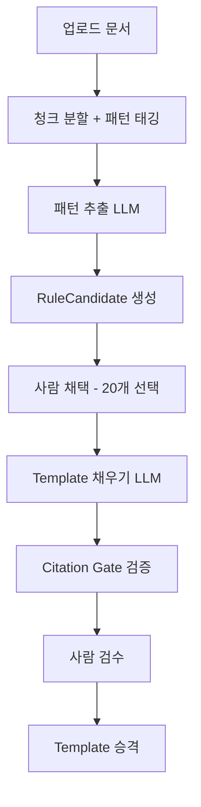
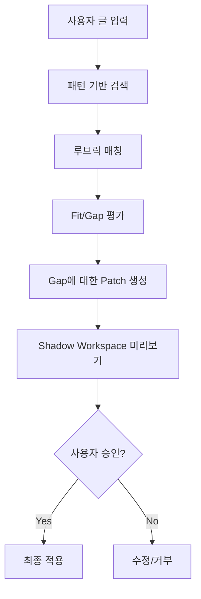

# PRISM Writer - 루브릭 파이프라인 통합 설계 v2.0

> **목적**: 업로드 자료(스크립트/강의)에서 **주제 무관 형식 패턴**을 추출하여 루브릭화하고, 사용자 글에 적용하는 파이프라인 설계
>
> **핵심 원칙**: "내용이 아닌 형식"을 기준으로 평가하여, 주제가 달라도 적용 가능

| 항목   | 내용                                    |
| ------ | --------------------------------------- |
| 작성일 | 2026-01-03                              |
| 버전   | 2.0 (회의 결과 반영)                    |
| 작성자 | 수연(루브릭), 지후(리트리벌), Tech Lead |
| 상태   | 검토 대기                               |

---

## 1. 서비스 핵심 정의

> **"업로드한 레퍼런스에 맞게 글을 '평가 → 개선안 제시 → 사용자 승인으로 수정'까지 해주는 서비스"**

### 1.1 핵심 가치 3가지

| 순서 | 가치            | 설명                                               |
| ---- | --------------- | -------------------------------------------------- |
| 1    | **기준 추출**   | 업로드 자료에서 "형식 패턴"을 정확히 뽑아 루브릭화 |
| 2    | **일관된 판정** | 근거 + 게이트로 판정이 흔들리지 않게               |
| 3    | **안전한 수정** | Patch + 미리보기로 원치 않는 변경 방지             |

### 1.2 주제 무관 적용의 핵심

❌ **기존 방식**: "마케팅 글을 잘 쓰는 법" → 마케팅 글에만 적용 가능
✅ **새로운 방식**: "설득 장치 패턴" → 모든 주제에 적용 가능

---

## 2. 형식 중심 루브릭 카테고리 (6개)

> 수연(루브릭 전문가) 설계 - 주제와 무관하게 적용 가능한 형식 기준

| 카테고리      | 코드         | 설명           | 예시 항목                            |
| ------------- | ------------ | -------------- | ------------------------------------ |
| **구조**      | `structure`  | 글의 뼈대 패턴 | 훅→문제정의→원인→해결→증거→CTA       |
| **어투**      | `tone`       | 말하기 스타일  | 단정/친근/권위/공감/도발             |
| **설득 장치** | `persuasion` | 설득 기법      | 대비, 비유, 숫자/통계, 반박 선제처리 |
| **리듬**      | `rhythm`     | 문장 패턴      | 짧은 문장 비율, 질문 사용, 반복 구조 |
| **신뢰 형성** | `trust`      | 근거 제시 방식 | 근거→해석→적용 순서, 한계 인정       |
| **행동 유도** | `cta`        | CTA 설계       | 구체성, 마찰 감소 문장               |

### 2.1 기존 rubrics.ts 매핑

| 기존 카테고리      | 새 카테고리 매핑                  |
| ------------------ | --------------------------------- |
| `structure` (3개)  | `structure` (유지)                |
| `content` (2개)    | `trust` (신뢰 형성으로 재정의)    |
| `logic` (2개)      | `persuasion` (설득 장치로 재정의) |
| `evidence` (2개)   | `trust` (신뢰 형성에 통합)        |
| `expression` (1개) | `tone` + `rhythm` (분리)          |

---

## 3. 패턴 기반 리트리벌 설계

> 지후(리트리벌 전문가) 설계 - 주제 키워드가 아닌 형식 신호로 검색

### 3.1 인덱스 설계 (3종)

| 인덱스            | 테이블                        | 저장 내용                         | 용도           |
| ----------------- | ----------------------------- | --------------------------------- | -------------- |
| **Pattern Index** | `rag_chunks` + `pattern_type` | 청크별 패턴 태그 (훅/CTA/비유 등) | 패턴 기반 검색 |
| **Example Index** | `rag_templates.criteria_json` | do/don't 예시                     | 예시 기반 검색 |
| **Rule Index**    | `rag_templates`               | 규칙 설명                         | 규칙 검색      |

### 3.2 rag_chunks 테이블 확장

```sql
ALTER TABLE rag_chunks ADD COLUMN pattern_type TEXT;
-- 값: 'hook' | 'problem' | 'cause' | 'solution' | 'evidence' | 'cta' | 'metaphor' | 'contrast' | 'statistics' | 'rebuttal'
```

### 3.3 패턴 기반 쿼리 변환

| 사용자 입력          | 기존 쿼리        | 새 쿼리                               |
| -------------------- | ---------------- | ------------------------------------- |
| "설득력 있게 고쳐줘" | ❌ "설득력" 검색 | ✅ `pattern_type = 'persuasion'` 검색 |
| "도입부를 강하게"    | ❌ "도입부" 검색 | ✅ `pattern_type = 'hook'` 검색       |
| "근거를 보강해줘"    | ❌ "근거" 검색   | ✅ `pattern_type = 'evidence'` 검색   |

---

## 4. 파이프라인 아키텍처

### 4.1 전체 흐름

```
[Phase A: Pattern → Rubric Builder]
업로드 자료 → 패턴 추출 LLM → 형식 루브릭 생성 → 예시/근거 첨부 → Template 승격

[Phase B: Apply & Coach]
내 글 입력 → 루브릭 기반 평가 → Fit/Gap 분석 → Patch 제안 → 미리보기 → 승인
```

### 4.2 Phase A 상세 (패턴 추출)



### 4.3 Phase B 상세 (적용)



---

## 5. 데이터 모델 (PRISM 시스템 매핑)

### 5.1 기존 테이블 활용

| 기존 테이블       | 역할             | 추가 필요                   |
| ----------------- | ---------------- | --------------------------- |
| `user_documents`  | 업로드 문서 저장 | ✅ 그대로 사용              |
| `rag_chunks`      | 문서 청크 저장   | 🔸 `pattern_type` 컬럼 추가 |
| `rag_templates`   | 템플릿 저장      | ✅ 그대로 사용              |
| `evaluation_logs` | 평가 결과 저장   | ✅ 그대로 사용              |

### 5.2 새로 추가할 테이블

```sql
-- 패턴 후보 (LLM 1차 산출물)
CREATE TABLE rag_rule_candidates (
  id UUID PRIMARY KEY DEFAULT gen_random_uuid(),
  project_id UUID REFERENCES projects(id) ON DELETE CASCADE,
  user_id UUID REFERENCES auth.users(id) ON DELETE CASCADE,
  pattern_type TEXT NOT NULL,
  rule_text TEXT NOT NULL,
  why_it_works TEXT,
  query_hints TEXT[],
  evidence_chunk_ids UUID[],
  status TEXT DEFAULT 'draft', -- draft | selected | filled | published
  created_at TIMESTAMPTZ DEFAULT NOW()
);
```

### 5.3 Template 스키마 확장

```typescript
// templateTypes.ts 확장
export interface TemplateSchema {
  criteria_id: string;
  category:
    | "tone"
    | "structure"
    | "expression"
    | "prohibition"
    | "persuasion"
    | "rhythm"
    | "trust"
    | "cta"; // 확장
  rationale: string;
  positive_examples: string[];
  negative_examples: string[];
  remediation_steps: string[];
  source_citations: string[];
  confidence_score?: number;

  // [신규] 패턴 기반 필드
  pattern_type?: string; // hook | cta | metaphor | contrast | ...
  query_hints?: string[]; // 검색용 힌트 키워드
  pass_conditions?: string[]; // 통과 조건 (관찰 가능한 문장)
  fail_patterns?: string[]; // 실패 패턴
}
```

---

## 6. 기존 시스템 통합 매핑

### 6.1 현재 구현된 것 ✅

| 컴포넌트          | 파일                  | 상태                                       |
| ----------------- | --------------------- | ------------------------------------------ |
| 루브릭 정의       | `rubrics.ts`          | ✅ 10개 항목 존재 (재설계 필요)            |
| 루브릭 어댑터     | `rubricAdapter.ts`    | ✅ Rubric ↔ Template 변환                  |
| 템플릿 타입       | `templateTypes.ts`    | ✅ 스키마 정의됨                           |
| 템플릿 레지스트리 | `templateRegistry.ts` | ✅ CRUD 서비스                             |
| 템플릿 게이트     | `templateGates.ts`    | ✅ Citation/Consistency/Hallucination Gate |
| 템플릿 빌더       | `templateBuilder.ts`  | ✅ 템플릿 생성 빌더                        |
| Shadow Workspace  | (구현됨)              | ✅ Patch 미리보기                          |
| 승인형 Patch      | (구현됨)              | ✅ 사용자 승인 시스템                      |

### 6.2 새로 구현 필요 🔸

| 컴포넌트         | 설명                           | 우선순위 |
| ---------------- | ------------------------------ | -------- |
| 패턴 추출 LLM    | 업로드 자료에서 형식 패턴 추출 | P0       |
| 패턴 태깅 서비스 | 청크에 pattern_type 할당       | P0       |
| 패턴 기반 검색   | pattern_type으로 검색          | P1       |
| 루브릭 채택 UI   | 후보 중 20개 선택              | P1       |
| 근거 검수 UI     | 사람이 인용 검증               | P2       |

---

## 7. 구현 우선순위

### P0 (즉시 적용 가능)

| 순서 | 작업                                    | 담당      | 예상 시간 |
| ---- | --------------------------------------- | --------- | --------- |
| 1    | `rag_chunks`에 `pattern_type` 컬럼 추가 | DB        | 10분      |
| 2    | `rubrics.ts` 형식 중심 재설계           | 수연      | 30분      |
| 3    | `USE_TEMPLATE_FOR_CHAT = true` 활성화   | Tech Lead | 5분       |
| 4    | 패턴 추출 LLM 프롬프트 설계             | Tech Lead | 1시간     |

### P1 (품질 고정)

| 순서 | 작업                     | 담당     | 예상 시간 |
| ---- | ------------------------ | -------- | --------- |
| 5    | 패턴 태깅 서비스 구현    | 지후     | 2시간     |
| 6    | 패턴 기반 검색 쿼리 변환 | 지후     | 2시간     |
| 7    | 루브릭 채택 UI           | Frontend | 4시간     |
| 8    | 골드셋 + 회귀 테스트     | 수연     | 2시간     |

### P2 (완성도)

| 순서 | 작업                 | 담당      | 예상 시간 |
| ---- | -------------------- | --------- | --------- |
| 9    | 근거 검수 UI         | Frontend  | 3시간     |
| 10   | 템플릿 버전 관리     | Tech Lead | 2시간     |
| 11   | 자동 승격 파이프라인 | Tech Lead | 3시간     |

---

## 8. Feature Flags

```typescript
// featureFlags.ts에 추가
ENABLE_PATTERN_EXTRACTION: process.env.ENABLE_PATTERN_EXTRACTION === 'true',
ENABLE_PATTERN_BASED_SEARCH: process.env.ENABLE_PATTERN_BASED_SEARCH === 'true',
ENABLE_RUBRIC_CANDIDATE_UI: process.env.ENABLE_RUBRIC_CANDIDATE_UI === 'true',
ENABLE_RUBRIC_PUBLISH_GATE: process.env.ENABLE_RUBRIC_PUBLISH_GATE !== 'false',
```

---

## 9. LLM 프롬프트 계약

### 9.1 패턴 추출 프롬프트 (Phase A)

```markdown
# 역할

당신은 글쓰기 패턴 분석 전문가입니다.

# 입력

업로드된 스크립트/강의 청크

# 작업

주제와 무관하게 적용 가능한 "형식 패턴"을 추출하세요.

# 추출할 패턴 유형

- structure: 글의 구조 (훅→문제→해결→증거→CTA)
- tone: 어투 스타일 (단정/친근/권위)
- persuasion: 설득 장치 (대비/비유/통계/반박)
- rhythm: 문장 리듬 (짧은 문장/질문/반복)
- trust: 신뢰 형성 (근거→해석→적용)
- cta: 행동 유도 (구체성/마찰 감소)

# 출력 형식 (JSON)

{
"pattern_type": "persuasion",
"rule_text": "반박을 선제적으로 처리한다",
"why_it_works": "독자의 의심을 미리 해소하여 설득력 강화",
"query_hints": ["반박", "하지만", "그럼에도"],
"evidence_quote": "원문에서 발췌한 예시..."
}
```

### 9.2 평가 프롬프트 (Phase B)

```markdown
# 역할

당신은 글쓰기 평가 전문가입니다.

# 루브릭

[여기에 Template의 pass_conditions, fail_patterns 삽입]

# 사용자 글

[사용자가 작성한 글]

# 작업

1. 각 루브릭 항목에 대해 Fit/Gap 분석
2. Gap이 있으면 구체적인 Patch 제안
3. Patch는 "형식/패턴" 변경만 (내용 변경 금지)

# 출력 형식 (JSON)

{
"criteria_id": "R01",
"status": "gap",
"observation": "도입부에 독자 이익이 명시되지 않음",
"patch_suggestion": "첫 문장을 '이 글을 읽으면 ~할 수 있습니다'로 시작"
}
```

---

## 10. 다음 단계

**디렉터님 승인 후:**

1. [ ] P0-1: `rag_chunks`에 `pattern_type` 컬럼 추가
2. [ ] P0-2: `rubrics.ts` 형식 중심 재설계
3. [ ] P0-3: `USE_TEMPLATE_FOR_CHAT = true` 활성화 테스트
4. [ ] P0-4: 패턴 추출 LLM 프롬프트 구현

---

_문서 끝_
