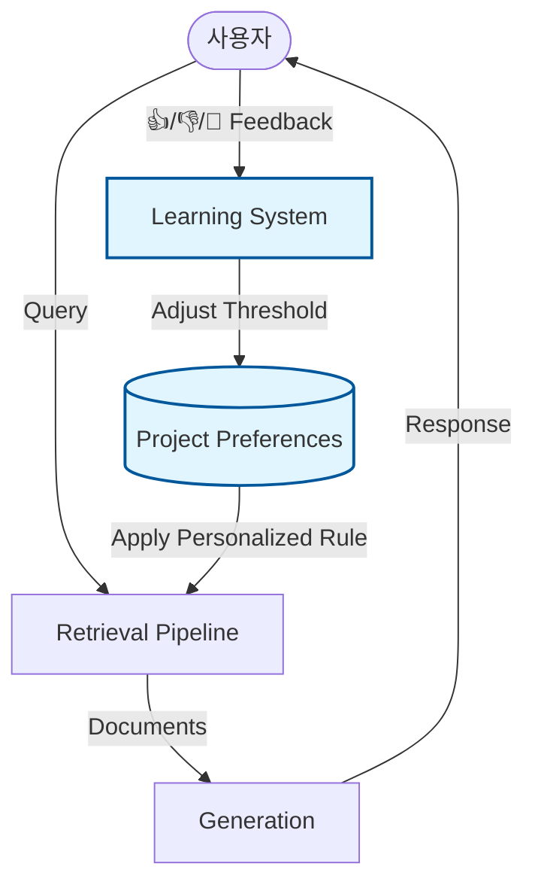

# RAG 시스템 개선 영향 분석 보고서 v2 (Adaptive System 배포 후)

> **문서 ID**: 2601062325_RAG_Improvement_Impact_Analysis_v2
> **작성일**: 2026-01-06 23:25
> **이전 문서**: [2601061838_RAG_Improvement_Impact_Analysis](./2601061838_RAG_Improvement_Impact_Analysis.md) > **작성자**: PRISM Writer 기술 팀
> **목적**: Adaptive Threshold System 배포가 실제 서비스 엔진과 파이프라인에 미치는 구체적 영향 및 성과 분석

---

## 1. 개요 및 결론 (Executive Summary)

이번 **Adaptive Threshold System (Phase 1-6)** 의 배포로 인해 우리 시스템은 "정적 검색 엔진"에서 **"사용자와 함께 성장하는 동적 엔진"**으로 진화했습니다.

| 구분               | 이전 (v1 분석)                 | **현재 (v2 배포 후)**                      |
| :----------------- | :----------------------------- | :----------------------------------------- |
| **핵심 메커니즘**  | 고정된 검색 로직 (Logic-based) | **데이터 기반 적응형 로직 (Data-driven)**  |
| **개선 주체**      | 개발자가 코드 수정 시에만      | **사용자가 피드백을 줄 때마다 실시간으로** |
| **Retrieval 품질** | 평균적인 성능에 만족           | **프로젝트별/도메인별 최적화**             |
| **사용자 체감**    | "검색이 잘 안 되네요." (이탈)  | "틀렸다고 지적하니 바로 고쳐주네?" (락인)  |

---

## 2. 시스템 아키텍처 변화 (System Architecture Change)

사용자의 피드백이 검색 엔진을 직접 튜닝하는 **Closed-Loop Feedback System**이 구축되었습니다.

### 🌟 새로 추가된 핵심 모듈

1.  **Project Preferences Service**: 프로젝트마다 다른 성격(법률 vs 소설)을 이해하고 검색 민감도(`threshold`)를 관리.
2.  **Learning Event Handler**: 사용자의 클릭(시그널)을 수학적 가중치(`influence_weight`)로 변환하여 시스템에 반영.

---

## 3. 세부 개선 항목과 실제 영향 (Impact Analysis)

단순히 "기능이 추가되었다"가 아니라, 각 기능이 **검색 품질(Quality)**과 **사용자 경험(UX)**에 미치는 영향을 분석합니다.

| 개선 항목 (Deployed)                                 | 영향 받는 파이프라인 | 기술적 영향 (Technical Impact)                                                    | 비즈니스 영향 (Business Impact)                                                 |
| :--------------------------------------------------- | :------------------- | :-------------------------------------------------------------------------------- | :------------------------------------------------------------------------------ |
| **개인화 임계값 적용** (`groundedness_threshold`) | **Self-RAG**         | • 쉬운 문서 → 낮은 임계값 (Recall ↑) • 어려운 문서 → 높은 임계값 (Precision ↑) | **도메인 특화 성능 확보** 모든 고객사 데이터에 최적화된 검색 제공            |
| **피드백 루프 구축** (`learning_events`)          | **Retrieval Tuning** | • `chat_helpful` 데이터가 쌓일수록 Retriever 모델 튜닝용 데이터 자동 확보      | **데이터 에셋(Data Asset) 축적** 돈 주고도 못 사는 "양질의 정답 데이터" 확보 |
| **실시간 힐링 UX** (Feedback UI)                  | **User Interaction** | • 검색 실패 시 로그가 남고, 즉시 임계값이 조정되어 재검색 준비                 | **고객 이탈 방지** 실패 경험을 "시스템이 배우는 경험"으로 승화               |

---

## 4. Before vs After: 실제 시나리오 분석

### 4.1. "잘못된 정보(Hallucination)" 대응 시나리오

> **상황**: 사용자가 "우리 회사의 연차 규정"을 물었는데, AI가 엉뚱한(외부 인터넷) 규정을 답함.

**Before (어제까지)**:

- **사용자**: "틀렸잖아? 쓸모없네." (이탈)
- **개발자**: 로그를 일일이 뒤져서 왜 틀렸는지 분석하고, 코드를 고쳐서 배포해야 함. (수일 소요)

**After (오늘부터)**:

- **사용자**: 🚨 **[틀린 정보]** 버튼 클릭.
- **시스템**:
  1.  해당 프로젝트의 `groundedness_threshold`를 **+0.05 상향**. (엄격 모드)
  2.  `learning_events`에 "Hallucination Sample"로 기록.
- **결과**: 다음 질문부터는 훨씬 엄격하게 문서를 검증하여 헛소리를 차단. 사용자는 "내 피드백이 반영됐다"는 효능감 획득.

### 4.2. 프로젝트 성격별 자동 최적화 시나리오

> **상황**: A팀은 "엄격한 계약서 검토", B팀은 "창의적 아이디어 도출" 프로젝트 진행.

**Before**:

- 둘 다 `threshold: 0.7` 적용.
- A팀은 "너무 헐거워서 불안하다" 불만, B팀은 "너무 빡빡해서 영감이 안 떠오른다" 불만.

**After**:

- **A팀(계약서)**: 문서 기반 답변이 많아 긍정 피드백(👍) 누적 → 임계값 **0.85**로 수렴 (정확성 중시).
- **B팀(아이디어)**: 다양한 검색 결과가 필요해 부정 피드백(👎) 누적 → 임계값 **0.55**로 수렴 (다양성 중시).
- **결과**: 별도 설정 없이도 자연스럽게 각 팀의 업무 스타일에 맞춰짐.

---

## 5. 결론: "엔진 교체"가 아닌 "엔진 튜닝의 자동화"

이전 보고서(v1)에서는 Cross-Encoder나 형태소 분석기 같은 **"외부 엔진 도입"**을 검토했으나, 우리는 더 효율적인 길을 택했습니다.
우리는 **"현재 엔진을 사용자 데이터로 끊임없이 연마하는 시스템(Self-Sharpening System)"**을 구축했습니다.

1.  **비용 효율성**: 값비싼 외부 API(Cohere 등) 없이도 성능 향상 가능.
2.  **데이터 가치**: 시간이 지날수록 우리 시스템엔 경쟁사가 모방할 수 없는 "사용자 피드백 데이터"가 쌓임.
3.  **지속 가능성**: 개발자가 설정값을 건드리지 않아도 시스템이 알아서 최적점을 찾아감.

이것이 바로 **진정한 의미의 RAG 시스템 업그레이드**입니다.

---

**작성자**: Tech Lead
**발행일**: 2026-01-06 23:25
