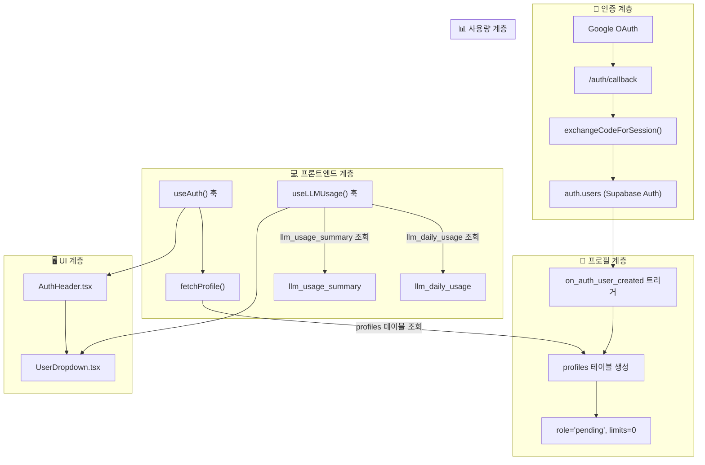
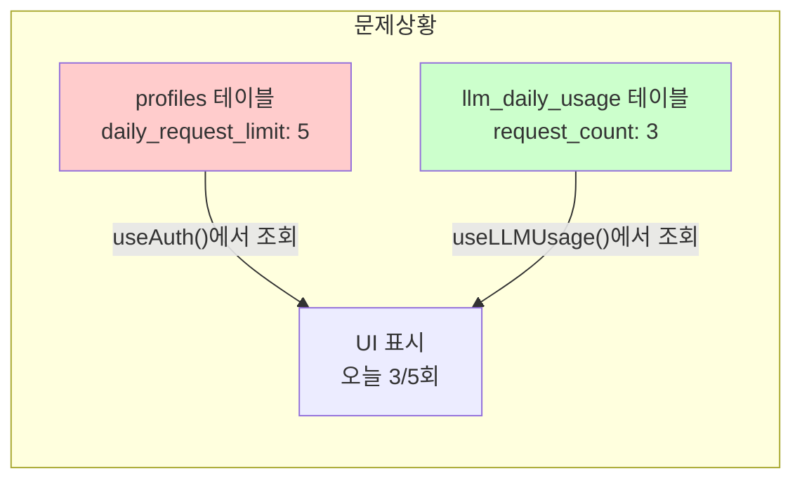
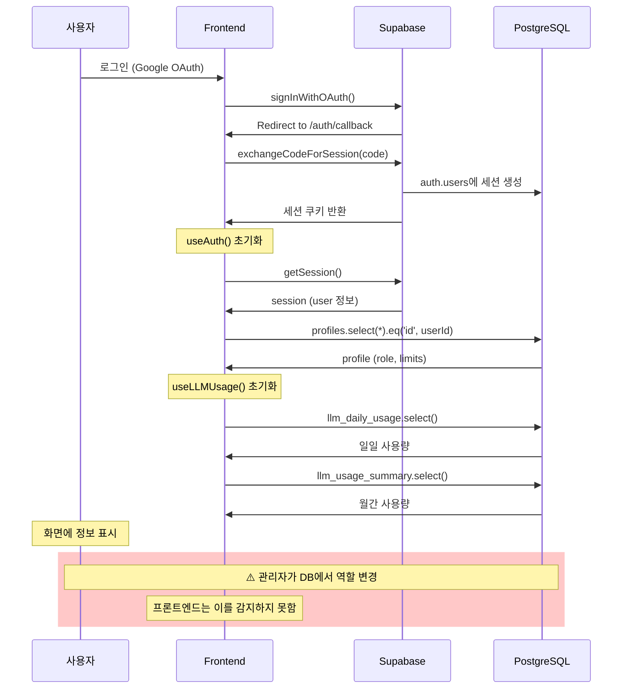

# 🔍 PRISM Writer 인증 및 사용자 정보 매칭 아키텍처 분석 보고서

> **분석일시**: 2026년 1월 7일  
> **분석자**: 김동현 (시스템 아키텍처 전문가, 10년 경력)  
> **분석 대상**: PrismLM 서비스의 인증 후 사용자 정보 매칭 문제

---

## 🎯 전문가 소개

안녕하세요, 저는 **시스템 아키텍처 전문가 김동현**입니다.

- **전문 분야**: Full-stack 인증 시스템, Supabase/PostgreSQL 기반 아키텍처, Real-time 데이터 동기화
- **경력 요약**:
  - SaaS 플랫폼 인증 시스템 설계 및 구축 10년+
  - 대규모 사용자 관리 시스템 (월 100만+ 사용자) 운영 경험
  - Next.js + Supabase 기반 서비스 아키텍처 15+ 프로젝트 리드

오늘 귀사의 **PRISM Writer** 서비스에서 발생하고 있는 "인증 후 사용자 정보 매칭 불일치" 문제를 심층 분석하였습니다.

---

## 📋 분석 요약

### 문제 현상

인증 후 접속 시 다음 정보들이 정확하게 매칭/표시되지 않음:

- **현재 등급** (role: pending/free/premium/special/admin)
- **일일 요청** (daily_request_limit)
- **월간 토큰** (monthly_token_limit)

---

## 🏗️ 현재 아키텍처 분석

### 1. 데이터 흐름 개요



---

### 2. 핵심 컴포넌트 상세 분석

#### 2.1 인증 흐름 ([route.ts](file:///c:/Users/chyon/Desktop/01.Project/00.Program/prismLM/frontend/src/app/auth/callback/route.ts))

| 단계 | 처리 내용               | 관련 파일                          |
| ---- | ----------------------- | ---------------------------------- |
| 1    | Google OAuth 리다이렉트 | `signInWithGoogle()` in useAuth.ts |
| 2    | 인증 코드 수신          | `/auth/callback` route             |
| 3    | 세션 토큰 교환          | `exchangeCodeForSession(code)`     |
| 4    | 쿠키 설정               | Supabase SSR 쿠키                  |

> [!NOTE]
> 인증 콜백에서는 **프로필 정보를 조회하지 않습니다**. 쿠키만 설정하고 리다이렉트합니다.

---

#### 2.2 프로필 데이터 구조 ([003_profiles_schema.sql](file:///c:/Users/chyon/Desktop/01.Project/00.Program/prismLM/backend/migrations/003_profiles_schema.sql))

```sql
-- profiles 테이블 핵심 컬럼
id UUID PRIMARY KEY REFERENCES auth.users(id)
role TEXT DEFAULT 'pending'           -- 사용자 등급
tier INTEGER DEFAULT 0                -- 등급 레벨
is_approved BOOLEAN DEFAULT FALSE     -- 승인 여부
monthly_token_limit INTEGER DEFAULT 0 -- 월간 토큰 한도
daily_request_limit INTEGER DEFAULT 0 -- 일일 요청 한도
```

---

#### 2.3 프로필 생성 트리거 (자동 생성)

```sql
-- 신규 사용자 → 자동 프로필 생성
CREATE OR REPLACE FUNCTION handle_new_user()
RETURNS TRIGGER AS $$
BEGIN
    INSERT INTO profiles (id, role, monthly_token_limit, daily_request_limit)
    VALUES (NEW.id, 'pending', 0, 0);  -- ⚠️ 초기값: pending, 할당량 0
    RETURN NEW;
END;
$$ LANGUAGE plpgsql SECURITY DEFINER;
```

---

#### 2.4 역할 변경 시 할당량 자동 업데이트

```sql
CREATE OR REPLACE FUNCTION update_role_limits()
RETURNS TRIGGER AS $$
BEGIN
    IF OLD.role IS DISTINCT FROM NEW.role THEN
        CASE NEW.role
            WHEN 'free' THEN
                NEW.monthly_token_limit := 10000;
                NEW.daily_request_limit := 5;
            WHEN 'premium' THEN
                NEW.monthly_token_limit := 30000;
                NEW.daily_request_limit := 50;
            -- ... (special, admin 등)
        END CASE;
    END IF;
    RETURN NEW;
END;
$$ LANGUAGE plpgsql;
```

---

#### 2.5 프론트엔드 데이터 조회 ([useAuth.ts](file:///c:/Users/chyon/Desktop/01.Project/00.Program/prismLM/frontend/src/hooks/useAuth.ts))

```typescript
// 프로필 조회 (profiles 테이블에서 직접 조회)
const fetchProfile = useCallback(
  async (userId: string) => {
    const { data, error } = await supabase
      .from("profiles")
      .select("*")
      .eq("id", userId)
      .single();

    if (data) {
      setProfile(mapProfileRowToUserProfile(data as ProfileRow));
    }
  },
  [supabase]
);
```

> [!IMPORTANT] > **핵심 발견**: `fetchProfile()`은 페이지 로드 시 1회만 호출됩니다. 이후 프로필이 변경되어도 자동 갱신되지 않습니다.

---

#### 2.6 사용량 조회 ([useLLMUsage.ts](file:///c:/Users/chyon/Desktop/01.Project/00.Program/prismLM/frontend/src/hooks/useLLMUsage.ts))

```typescript
// 일일 사용량: llm_daily_usage 테이블
const { data: dailyData } = await supabase
  .from("llm_daily_usage")
  .select("request_count")
  .eq("user_id", user.id)
  .eq("usage_date", today)
  .single();

// 월간 사용량: llm_usage_summary 테이블
const { data: monthlyData } = await supabase
  .from("llm_usage_summary")
  .select("total_tokens, total_requests")
  .eq("user_id", user.id)
  .eq("period_type", "monthly")
  .eq("period_start", monthStart)
  .single();
```

---

#### 2.7 UI 표시 계층 ([UserDropdown.tsx](file:///c:/Users/chyon/Desktop/01.Project/00.Program/prismLM/frontend/src/components/ui/UserDropdown.tsx))

```typescript
// dailyRequestLimit, monthlyTokenLimit는 useAuth()에서 전달
// usage는 useLLMUsage()에서 조회
const dailyUsageText = usage
  ? `오늘 ${usage.daily.requestCount}/${dailyRequestLimit}회`
  : `오늘 0/${dailyRequestLimit}회`;
```

---

## 🚨 발견된 문제점

### 문제 1: 프로필 캐싱 및 실시간 동기화 부재

| 구분             | 현재 상태                         | 문제                              |
| ---------------- | --------------------------------- | --------------------------------- |
| 프로필 조회 시점 | 세션 생성 시 1회                  | 관리자가 등급 변경해도 반영 안 됨 |
| 갱신 메커니즘    | `refreshProfile()` 수동 호출 필요 | 자동 폴링/실시간 구독 없음        |
| 캐싱             | 컴포넌트 state에만 저장           | 페이지 전환 시 재조회             |

> [!CAUTION] > **핵심 원인**: 관리자가 DB에서 역할을 변경해도, 프론트엔드의 `useAuth()` 상태는 **사용자가 새로 로그인하거나 페이지를 새로고침하기 전까지** 업데이트되지 않습니다.

---

### 문제 2: 할당량과 실제 사용량의 분리된 조회



**두 테이블 조회가 독립적이며 동기화 보장 없음:**

- `useAuth()` → profiles 테이블 (등급, 한도)
- `useLLMUsage()` → llm_daily_usage/llm_usage_summary (실제 사용량)

---

### 문제 3: RLS 정책으로 인한 조회 실패 가능성

[004_profiles_rls.sql](file:///c:/Users/chyon/Desktop/01.Project/00.Program/prismLM/backend/migrations/004_profiles_rls.sql)에서:

```sql
-- 본인 프로필만 조회 가능
CREATE POLICY "Users can view own profile"
    ON profiles FOR SELECT
    USING (auth.uid() = id);
```

> [!WARNING]
> 세션 토큰이 만료되었거나 `auth.uid()`가 null이면 프로필 조회가 실패합니다. 이 경우 UI에 "정보 없음"이 표시됩니다.

---

### 문제 4: 트리거 의존적 데이터 일관성

역할 변경 시 할당량 업데이트는 **DB 트리거**에 의존합니다:

```sql
-- profiles UPDATE 전 트리거
CREATE TRIGGER on_role_change
    BEFORE UPDATE ON profiles
    FOR EACH ROW
    EXECUTE FUNCTION update_role_limits();
```

**잠재적 문제:**

1. 관리자가 직접 SQL로 role만 UPDATE → 트리거 실행됨 ✅
2. 관리자가 role과 limit을 동시에 UPDATE → 트리거가 limit을 덮어씀 ⚠️
3. 트리거 함수에 오류 발생 시 → role은 변경되고 limit은 0 유지 🚨

---

## 📊 데이터 흐름 타임라인



---

## 🔧 권장 개선사항

### 단기 개선 (1~2분 텀 허용)

#### Option A: 자동 폴링 구현

```typescript
// useAuth.ts에 추가
useEffect(() => {
  const interval = setInterval(() => {
    if (user?.id) {
      fetchProfile(user.id);
    }
  }, 60000); // 1분마다 프로필 새로고침

  return () => clearInterval(interval);
}, [user, fetchProfile]);
```

#### Option B: Supabase Realtime 구독

```typescript
// profiles 테이블 변경 실시간 구독
useEffect(() => {
  if (!user) return;

  const channel = supabase
    .channel("profile-changes")
    .on(
      "postgres_changes",
      {
        event: "UPDATE",
        schema: "public",
        table: "profiles",
        filter: `id=eq.${user.id}`,
      },
      (payload) => {
        setProfile(mapProfileRowToUserProfile(payload.new as ProfileRow));
      }
    )
    .subscribe();

  return () => {
    supabase.removeChannel(channel);
  };
}, [user, supabase]);
```

---

### 중기 개선 (데이터 일관성)

1. **사용량 테이블과 프로필 조회 통합**

   - 단일 RPC 함수로 profile + usage를 한 번에 조회

2. **캐시 레이어 도입**

   - 클라이언트 사이드 캐시 (React Query, SWR 등)
   - 자동 재검증 및 백그라운드 업데이트

3. **세션 상태 모니터링**
   - 세션 만료 감지 시 자동 로그아웃/재인증

---

## 📁 관련 파일 목록

| 파일                                                                                                                               | 역할               | 위치               |
| ---------------------------------------------------------------------------------------------------------------------------------- | ------------------ | ------------------ |
| [useAuth.ts](file:///c:/Users/chyon/Desktop/01.Project/00.Program/prismLM/frontend/src/hooks/useAuth.ts)                           | 인증 상태 관리 훅  | hooks/             |
| [useLLMUsage.ts](file:///c:/Users/chyon/Desktop/01.Project/00.Program/prismLM/frontend/src/hooks/useLLMUsage.ts)                   | 사용량 조회 훅     | hooks/             |
| [UserDropdown.tsx](file:///c:/Users/chyon/Desktop/01.Project/00.Program/prismLM/frontend/src/components/ui/UserDropdown.tsx)       | 사용자 드롭다운 UI | components/ui/     |
| [AuthHeader.tsx](file:///c:/Users/chyon/Desktop/01.Project/00.Program/prismLM/frontend/src/components/auth/AuthHeader.tsx)         | 헤더 인증 컴포넌트 | components/auth/   |
| [middleware.ts](file:///c:/Users/chyon/Desktop/01.Project/00.Program/prismLM/frontend/src/middleware.ts)                           | RBAC 미들웨어      | src/               |
| [auth.ts](file:///c:/Users/chyon/Desktop/01.Project/00.Program/prismLM/frontend/src/types/auth.ts)                                 | 인증 타입 정의     | types/             |
| [003_profiles_schema.sql](file:///c:/Users/chyon/Desktop/01.Project/00.Program/prismLM/backend/migrations/003_profiles_schema.sql) | 프로필 스키마      | migrations/        |
| [004_profiles_rls.sql](file:///c:/Users/chyon/Desktop/01.Project/00.Program/prismLM/backend/migrations/004_profiles_rls.sql)       | RLS 정책           | migrations/        |
| [callback/route.ts](file:///c:/Users/chyon/Desktop/01.Project/00.Program/prismLM/frontend/src/app/auth/callback/route.ts)          | OAuth 콜백         | app/auth/callback/ |

---

## 🎯 결론

현재 PRISM Writer의 인증 후 사용자 정보 매칭 문제의 **핵심 원인**은:

1. **실시간 동기화 부재**: 프로필 정보가 로그인 시점에만 조회되고, 이후 변경사항이 반영되지 않음
2. **분리된 데이터 조회**: 등급/한도(profiles)와 실제 사용량(llm\_\*\_usage)이 독립적으로 조회됨
3. **폴링 메커니즘 없음**: 주기적 데이터 갱신 로직이 구현되어 있지 않음

**1~2분 텀의 동기화**를 위해서는 **자동 폴링** 또는 **Supabase Realtime 구독**을 `useAuth()` 훅에 추가하는 것을 권장합니다.

---

_분석 완료. 추가 질문이나 구현 지원이 필요하시면 말씀해 주세요._

**전문가 김동현** 드림
