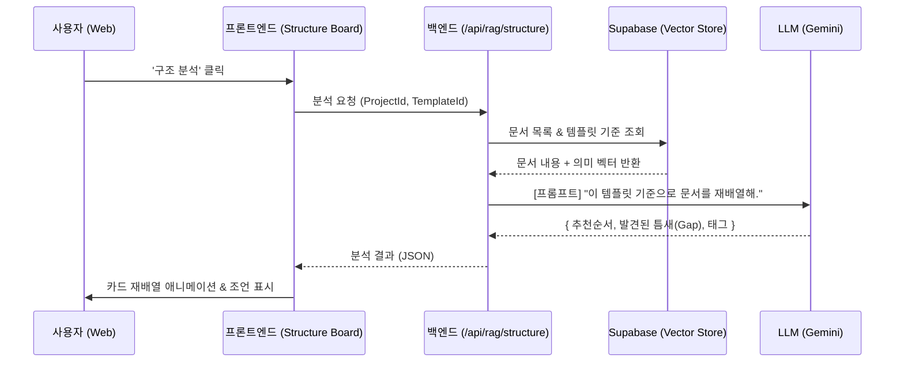

# 기술 심층 분석: AI 구조(Structure) 탭의 작동 원리

**문서 번호:** 260108_Structure_DeepDive
**작성일:** 2026-01-08
**작성자:** Antigravity (Tech Lead)
**대상:** 차기 기능 기획자 및 개발자

---

## 1. 개요 (Overview)

'구조(Structure)' 탭은 단순한 문서 목록 배치가 아닙니다.
**RAG(검색 증강 생성)** 기술과 **LLM(거대 언어 모델)**의 추론 능력을 결합하여, 프로젝트 내 문서들이 **"논리적으로 완벽한 흐름"**을 갖추도록 설계해주는 지능형 엔진입니다.

---

## 2. 핵심 작동 프로세스 (Core Process)

### Step 1: 문서 DNA 추출 (Vectorizing)

사용자가 '구조 분석' 버튼을 누르면, 시스템은 먼저 프로젝트 내 모든 문서의 **DNA(의미 벡터)**를 추출합니다.

- **Technique**: 단순히 텍스트만 읽는 것이 아니라, 각 문서가 어떤 주제를 담고 있는지 **'의미적 중심(Semantic Centroid)'**을 파악합니다.
- **Why?**: 키워드가 달라도 주제가 같으면 같은 그룹으로 묶기 위함입니다.

### Step 2: 동적 루브릭 매핑 (Dynamic Rubric Mapping) ✨

여기가 가장 중요한 **지능형 로직**의 핵심입니다.

- **Input**: 사용자가 선택한 **템플릿(Rubric)** (예: 소설, 논문, 기획서).
- **Logic**:
  > "이 글은 '소설' 템플릿이니까, 서론/본론/결론이 아니라 **기승전결(발단-전개-위기-절정-결말)** 구조로 분석해야 해."
- **Output**: AI는 각 문서를 읽고 "이 문서는 '위기'에 해당합니다", "이 문서는 '연구 방법론'입니다"라고 **동적 태그(Dynamic Tag)**를 부여합니다.

### Step 3: LLM 구조 최적화 (Structural Optimization)

부여된 태그와 내용을 바탕으로, AI가 최적의 순서를 시뮬레이션합니다.

- **Reordering**: "발단(A) 뒤에 바로 결말(C)이 오면 안 돼. 중간에 전개(B)를 넣어야 해." -> **A - B - C 순서 제안**.
- **Gap Detection**: "전개에서 절정으로 넘어가는데, 갈등이 고조되는 과정이 빠졌어." -> **[Missing Part] 감지**.

---

## 3. 데이터 흐름도 (Sequence Diagram)

---

## 4. 핵심 로직 상세 (Logic Details)

### 4.1. Metadata-Aware Analysis

글의 내용(Content)만 보지 않습니다.

- **생성 시간**: "나중에 쓴 글이 결론일 확률이 높다."
- **참조 횟수**: "다른 문서에서 많이 인용된 글은 핵심 개념일 수 있다."
  이러한 **메타데이터**를 AI에게 함께 제공하여 추론의 정확도를 높입니다.

### 4.2. Feedback Loop (학습 루프)

사용자가 AI의 제안을 거절하면 시스템은 이를 기억합니다.

- "이 사용자는 AI가 추천한 '두괄식'보다 '미괄식'을 선호해서 순서를 바꿨네."
- 이 데이터는 다음 분석 때 가중치로 작용하여 개인화된 결과를 줍니다.

---

## 5. 요약

'구조' 탭은 단순한 정렬 도구가 아닙니다.
**사용자가 선택한 장르(Template)의 문법을 이해하고, 그 문법에 맞게 글의 뼈대를 다시 맞춰주는 AI 편집자**입니다.

이 문서를 바탕으로 원하시는 업그레이드 내용을 말씀해주시면, 기존 로직을 해치지 않고 정확히 반영해 드릴 수 있습니다. 어떤 기능을 추가하고 싶으신가요? 🔧
